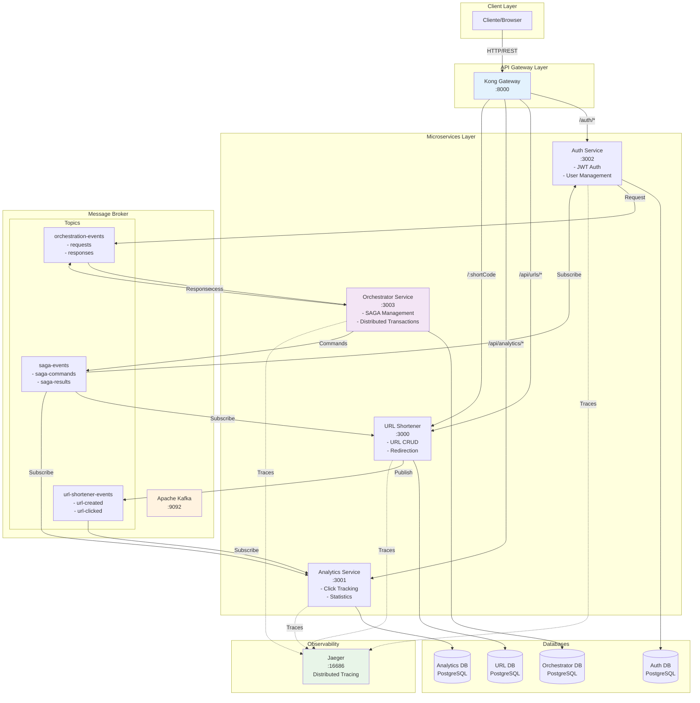

# URL Shortener - Arquitetura de Microsserviços

Este projeto demonstra a implementação de um encurtador de URLs utilizando arquitetura de microsserviços, aplicando padrões modernos e melhores práticas para sistemas distribuídos.

## 🏗️ Visão Geral da Arquitetura

O sistema é composto por quatro microsserviços independentes que se comunicam de forma assíncrona através de eventos Kafka e são orquestrados para transações distribuídas:



## 🎯 Padrões de Microsserviços Implementados

### 1. **API Gateway Pattern**
- Ponto único de entrada via Kong Gateway
- Roteamento inteligente e load balancing
- Autenticação centralizada com JWT
- [Documentação completa →](docs/04-api-gateway.md)

### 2. **Database per Service**
- Cada serviço possui seu próprio banco PostgreSQL
- Isolamento completo de dados
- Schema evolution independente
- [Documentação completa →](docs/02-persistencia-distribuida.md)

### 3. **Event-Driven Architecture**
- Comunicação assíncrona via Apache Kafka
- Publish-Subscribe pattern
- Baixo acoplamento entre serviços
- [Documentação completa →](docs/03-comunicacao-assincrona.md)

### 4. **Token-Based Authentication**
- Autenticação centralizada com JWT
- Validação stateless via JWKS
- Context injection nos serviços downstream
- [Documentação completa →](docs/01-autenticacao.md)

### 5. **Distributed Tracing**
- OpenTelemetry para observabilidade
- Jaeger para visualização de traces
- Correlação automática entre serviços
- [Documentação completa →](docs/05-rastreamento-distribuido.md)

### 6. **Idempotent Consumer**
- Processamento exactly-once de eventos
- Deduplicação automática
- Resiliência a falhas e retries
- [Documentação completa →](docs/06-idempotencia.md)

### 7. **SAGA Pattern**
- Orquestração de transações distribuídas
- Compensação automática em caso de falhas
- Comunicação 100% baseada em Kafka
- Persistência de estado em banco de dados
- [Documentação completa →](docs/07-saga-pattern.md)

## 🚀 Tecnologias Utilizadas

- **Runtime**: Node.js 22 com TypeScript nativo
- **Framework**: Fastify com validação Zod
- **Banco de Dados**: PostgreSQL com Drizzle ORM
- **Mensageria**: Apache Kafka
- **API Gateway**: Kong
- **Observabilidade**: OpenTelemetry + Jaeger
- **Containerização**: Docker & Docker Compose

## 📦 Estrutura do Projeto

```
.
├── apps/
│   ├── auth/                    # Serviço de autenticação
│   ├── url-shortener/           # Serviço principal
│   ├── analytics/               # Serviço de analytics
│   └── orchestrator/            # Serviço de orquestração SAGA
├── shared/                      # Código compartilhado
├── contracts/                   # Contratos de eventos
├── kong/                        # Configuração do gateway
├── docs/                        # Documentação detalhada
└── docker-compose.yml           # Infraestrutura
```

## 🏃 Quick Start

### Pré-requisitos
- Node.js 22 LTS
- Docker & Docker Compose
- Make (ferramenta de automação)
- Git

### Instalação e Execução

#### O que é Make?

Make é uma ferramenta de automação de compilação que executa comandos definidos em um arquivo chamado `Makefile`. É amplamente utilizada para automatizar tarefas repetitivas de desenvolvimento, como compilação, testes e deploy. Neste projeto, usamos Make para simplificar o setup e gerenciamento dos microsserviços.

#### Instalando o Make

**macOS:**
```bash
# Make já vem instalado por padrão no macOS
# Para verificar, execute:
make --version

# Se não estiver instalado (raro), instale via Homebrew:
brew install make
```

**Linux (Ubuntu/Debian):**
```bash
# Instalar o Make e ferramentas de compilação
sudo apt-get update
sudo apt-get install build-essential

# Verificar instalação
make --version
```

**Linux (Fedora/CentOS/RHEL):**
```bash
# Instalar o Make
sudo yum install make

# Ou no Fedora:
sudo dnf install make

# Verificar instalação
make --version
```

**Windows:**
```bash
# Opção 1: Usar WSL (Windows Subsystem for Linux) - RECOMENDADO
# Instale o WSL seguindo: https://docs.microsoft.com/pt-br/windows/wsl/install
# Depois instale o Make no WSL como no Linux

# Opção 2: Git Bash (vem com Git para Windows)
# O Make não vem incluído, mas você pode usar o Git Bash para comandos básicos

# Opção 3: Chocolatey
choco install make

# Opção 4: MinGW
# Baixe e instale MinGW de http://www.mingw.org/
# Adicione C:\MinGW\bin ao PATH do sistema
```

#### Setup Completo (Primeira Vez)
```bash
# Clone o repositório
git clone https://github.com/rocketseat-education/ftr-fundamentos-microsservicos.git
cd ftr-fundamentos-microsservicos

# Execute o setup completo (configura tudo automaticamente)
make setup
```

O comando `make setup` irá:
1. Copiar todos os arquivos `.env.example` para `.env`
2. Instalar dependências de todos os serviços
3. Iniciar a infraestrutura (Docker Compose)
4. Executar as migrações do banco de dados

#### Iniciando os Serviços
```bash
# Inicia todos os serviços em modo desenvolvimento
make dev

# Ou inicie serviços individuais
make dev-auth          # Terminal 1 - Auth Service
make dev-url-shortener # Terminal 2 - URL Shortener
make dev-analytics     # Terminal 3 - Analytics
make dev-orchestrator  # Terminal 4 - Orchestrator
```

## 📋 Comandos do Makefile

O projeto inclui um Makefile abrangente para simplificar o desenvolvimento e operações.

### Comandos Principais

| Comando | Descrição |
|---------|-----------|
| `make setup` | Setup completo inicial (instala deps, configura env, inicia infra, executa migrações) |
| `make dev` | Inicia todos os serviços em modo desenvolvimento |
| `make quick-start` | Combinação de `make infra-up` + `make dev` para início rápido |
| `make help` | Exibe todos os comandos disponíveis |

### Gerenciamento de Infraestrutura

| Comando | Descrição |
|---------|-----------|
| `make infra-up` | Inicia todos os serviços Docker (bancos, Kafka, Kong, Jaeger) |
| `make infra-down` | Para todos os serviços de infraestrutura |
| `make infra-restart` | Reinicia todos os serviços de infraestrutura |
| `make infra-logs` | Exibe logs em tempo real da infraestrutura |

### Operações de Banco de Dados

| Comando | Descrição |
|---------|-----------|
| `make db-push` | Aplica schemas do banco para todos os serviços (desenvolvimento) |
| `make db-generate` | Gera migrações para todos os serviços |
| `make db-migrate` | Executa migrações para todos os serviços (produção) |
| `make db-studio SERVICE=auth` | Abre Drizzle Studio para um serviço específico |

### Qualidade de Código

| Comando | Descrição |
|---------|-----------|
| `make lint` | Executa linter em todos os serviços |
| `make format` | Formata código de todos os serviços |
| `make check` | Executa todas as verificações (lint, format, type-check) |
| `make test` | Executa testes de todos os serviços |

### Monitoramento e Debug

| Comando | Descrição |
|---------|-----------|
| `make health-check` | Verifica saúde de todos os serviços |
| `make status` | Exibe status completo dos serviços e infraestrutura |
| `make logs SERVICE=auth` | Exibe logs de um serviço específico |
| `make jaeger-ui` | Abre Jaeger UI no navegador |
| `make kong-ui` | Abre Kong Manager no navegador |

### Utilitários

| Comando | Descrição |
|---------|-----------|
| `make clean` | Remove node_modules e arquivos gerados |
| `make reset` | **⚠️ CUIDADO** - Reset completo (apaga todos os dados) |

## 🔍 Principais Endpoints

### Autenticação
- `POST /auth/register` - Registro de usuário
- `POST /auth/login` - Login
- `POST /auth/refresh` - Renovar token
- `GET /auth/profile` - Perfil do usuário

### URL Shortener
- `POST /api/urls` - Criar URL curta
- `GET /api/urls` - Listar URLs do usuário
- `GET /:shortCode` - Redirecionar URL

### Analytics
- `GET /api/analytics/overview` - Visão geral
- `GET /api/analytics/urls/:shortCode` - Analytics por URL
- `GET /api/analytics/realtime` - Dados em tempo real

### Admin (SAGA Operations)
- `DELETE /auth/admin/users/:userId` - Deletar usuário (inicia SAGA)
- `GET /orchestrator/saga/:sagaId/status` - Status da SAGA

## 🏗️ Benefícios da Arquitetura

### Escalabilidade
- Serviços podem ser escalados independentemente
- Load balancing automático via Kong
- Processamento assíncrono via Kafka

### Resiliência
- Falhas isoladas por serviço
- Circuit breaker no gateway
- Retry automático com idempotência

### Manutenibilidade
- Deploy independente por serviço
- Versionamento de APIs
- Observabilidade completa

### Flexibilidade
- Tecnologias podem variar por serviço
- Schema evolution independente
- Novos serviços facilmente adicionados

## 📊 Monitoramento

### Jaeger UI
Acesse `http://localhost:16686` para visualizar traces distribuídos

### Kong Manager
Acesse `http://localhost:8002` para gerenciar o API Gateway

### Logs
Todos os serviços produzem logs estruturados com correlation IDs

## 🧪 Desenvolvimento

### Workflow Diário

```bash
# Início do dia
make infra-up      # Inicia infraestrutura
make dev           # Inicia todos os serviços

# Antes de commitar
make check         # Executa todas as verificações
make test          # Executa testes

# Final do dia
make stop          # Para os serviços
make infra-down    # Para a infraestrutura
```

### Trabalhando com Banco de Dados

```bash
# Após modificar arquivos de schema
make db-generate   # Gera migrações
make db-push       # Aplica ao banco

# Visualizar dados
make db-studio SERVICE=auth        # Auth database
make db-studio SERVICE=url-shortener # URL shortener database
make db-studio SERVICE=analytics   # Analytics database
```

### Scripts NPM Disponíveis (por serviço)

```bash
npm run dev        # Inicia em modo watch
npm run test       # Executa testes
npm run lint       # Linting com Biome
npm run db:push    # Aplica migrações
npm run db:studio  # Drizzle Studio
```

### Convenções
- TypeScript com experimental stripping
- Validação com Zod em todos endpoints
- Arquivos `.ts` para imports locais
- Biome para formatação e linting

## 🔧 Troubleshooting

### Serviços não estão iniciando?
```bash
# Verificar status da infraestrutura
make status

# Ver logs
make infra-logs           # Logs da infraestrutura
make logs SERVICE=auth    # Logs de serviço específico
```

### Problemas de conexão com banco de dados?
```bash
# Reiniciar bancos de dados
make infra-restart

# Re-executar migrações
make db-push
```

### Conflitos de porta?
```bash
# Parar todos os serviços
make stop
make infra-down

# Verificar processos usando as portas
lsof -i :3000  # URL shortener
lsof -i :3001  # Analytics
lsof -i :3002  # Auth
lsof -i :3003  # Orchestrator
```

### Precisa de um reset completo?
```bash
# ⚠️ AVISO: Isso apagará todos os dados!
make reset
make setup
```

## 📚 Documentação Detalhada

Para entender profundamente cada padrão implementado:

1. [Autenticação Centralizada](docs/01-autenticacao.md)
2. [Persistência Distribuída](docs/02-persistencia-distribuida.md)
3. [Comunicação Assíncrona](docs/03-comunicacao-assincrona.md)
4. [API Gateway](docs/04-api-gateway.md)
5. [Rastreamento Distribuído](docs/05-rastreamento-distribuido.md)
6. [Idempotência](docs/06-idempotencia.md)
7. [Padrão SAGA](docs/07-saga-pattern.md)

## 🤝 Contribuindo

Este projeto foi criado para fins educacionais sobre arquitetura de microsserviços. Contribuições são bem-vindas!

## 📝 Licença

MIT License - veja o arquivo LICENSE para detalhes.