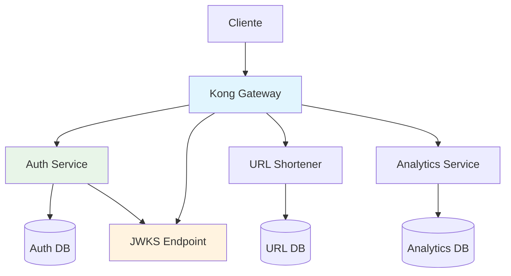
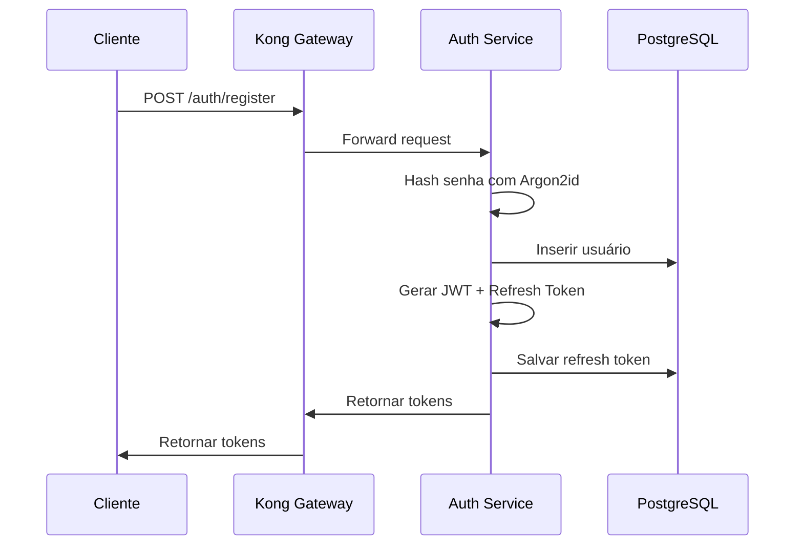
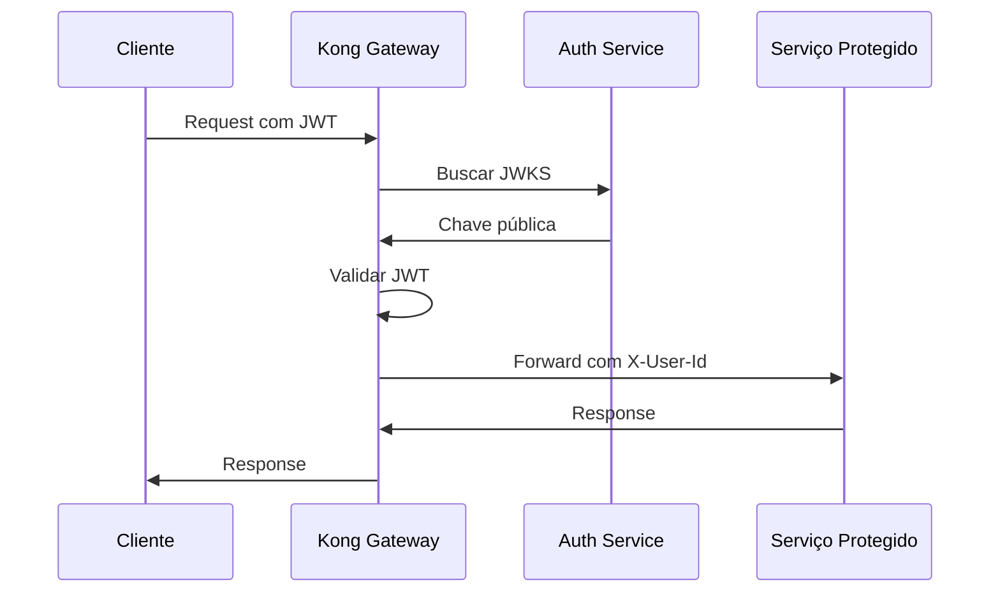

# Autenticação em Arquitetura de Microsserviços

## Visão Geral

Este documento explica como implementamos autenticação centralizada em uma arquitetura de microsserviços, utilizando JWT tokens e validação via API Gateway. Esta abordagem segue o padrão **Token-Based Authentication** com validação descentralizada.

## Arquitetura da Autenticação

## Padrões de Microsserviços Implementados

### 1. Centralized Authentication Service

O serviço de autenticação é responsável exclusivamente por:
- Registro de usuários
- Autenticação de credenciais
- Geração e renovação de tokens JWT
- Gestão de refresh tokens

**Vantagens:**
- Single Source of Truth para autenticação
- Facilita auditoria e compliance
- Simplifica mudanças na lógica de autenticação

### 2. Stateless Token Validation

Utilizamos JWT com validação JWKS no gateway, eliminando a necessidade de consultar o banco de dados para cada request. O auth service expõe um endpoint `/.well-known/jwks.json` que o Kong consulta para validar tokens.

### 3. Gateway-Level Authorization

O Kong Gateway valida tokens antes que cheguem aos serviços downstream, verificando assinatura, expiração e claims como issuer e audience.

## Implementação dos Padrões

### 1. Segurança com Argon2id

Utilizamos Argon2id para hash de senhas (`apps/auth/src/lib/password.ts:8-15`), escolhido ao invés de bcrypt por:
- **Resistência a ataques GPU/ASIC**: Função memory-hard (64MB)
- **Recomendação OWASP**: Vencedor da Password Hashing Competition
- **Proteção contra side-channel attacks**: Combina Argon2i e Argon2d

### 2. Token Management

- **Access Tokens**: JWT stateless com vida de 1h, validados via JWKS
- **Refresh Tokens**: Armazenados no banco com rotação após uso
- **Injeção de Contexto**: Kong injeta `x-user-id` nos headers para downstream services

## Fluxos de Autenticação

### Fluxo de Registro/Login

### Fluxo de Autorização

## Benefícios para Microsserviços

### 1. Escalabilidade
- **Stateless Validation**: Validação sem consulta ao banco
- **Cache de JWKS**: Chaves públicas cacheadas no gateway
- **Horizontal Scaling**: Auth service pode ser escalado independentemente

### 2. Segurança
- **Centralized Secret Management**: Secrets isolados no auth service
- **Gateway-Level Filtering**: Autenticação antes dos serviços downstream
- **Token Rotation**: Refresh tokens invalidados após uso

### 3. Autonomia dos Serviços
- **Separation of Concerns**: Lógica de auth centralizada
- **Consistent Context**: Todos os serviços recebem contexto padronizado via headers
- **Service Independence**: Serviços não precisam implementar autenticação

Este padrão de autenticação centralizada com validação distribuída é fundamental em arquiteturas de microsserviços, proporcionando segurança sem acoplamento entre serviços.