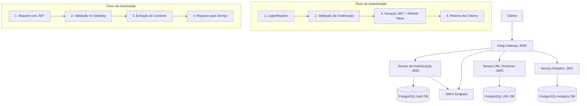
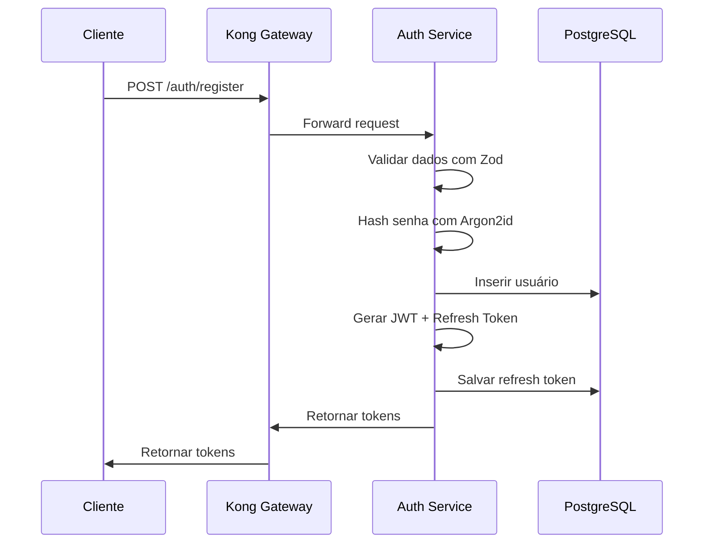
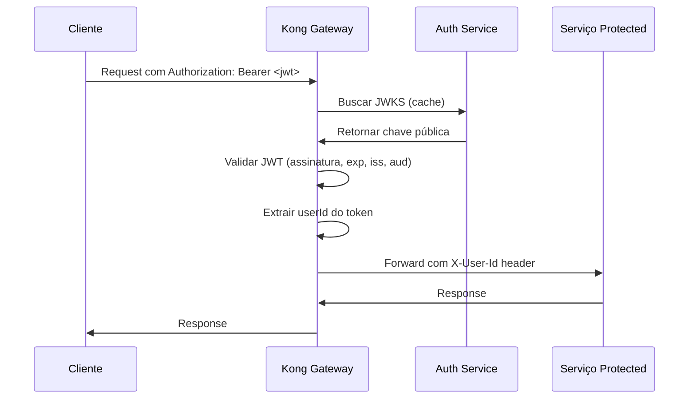

# Autenticação em Arquitetura de Microsserviços

## Visão Geral

Este documento explica como implementamos autenticação centralizada em uma arquitetura de microsserviços, utilizando JWT tokens e validação via API Gateway. Esta abordagem segue o padrão **Token-Based Authentication** com validação descentralizada.

## Arquitetura da Autenticação



## Padrões de Microsserviços Implementados

### 1. Centralized Authentication Service

O serviço de autenticação é responsável exclusivamente por:
- Registro de usuários
- Autenticação de credenciais
- Geração e renovação de tokens JWT
- Gestão de refresh tokens

**Vantagens:**
- Single Source of Truth para autenticação
- Facilita auditoria e compliance
- Simplifica mudanças na lógica de autenticação

### 2. Stateless Token Validation

Utilizamos JWT com validação JWKS no gateway, eliminando a necessidade de consultar o banco de dados para cada request:

```typescript
// apps/auth/src/routes/get-jwks.ts
export const getJwks: FastifyPluginAsyncZod = async (fastify) => {
  fastify.get(
    '/.well-known/jwks.json',
    {
      schema: {
        response: {
          200: JwksResponseSchema,
        },
      },
    },
    async (request, reply) => {
      const publicKey = await getJwtPublicKey()
      const jwk = await jose.exportJWK(publicKey)
      
      return reply.send({
        keys: [
          {
            ...jwk,
            kid: 'main',
            use: 'sig',
            alg: 'HS256',
          },
        ],
      })
    }
  )
}
```

### 3. Gateway-Level Authorization

O Kong Gateway valida tokens antes que cheguem aos serviços downstream:

```yaml
# kong/kong.yml
services:
- name: url-shortener
  plugins:
  - name: jwt
    config:
      key_claim_name: iss
      secret_is_base64: false
      run_on_preflight: true
      uri_param_names:
      - token
      cookie_names: []
      claims_to_verify:
      - exp
      - iss
      - aud
```

## Implementação Detalhada

### 1. Serviço de Autenticação

#### Registro de Usuário
```typescript
// apps/auth/src/routes/register-user.ts:35-60
const hashedPassword = await hashPassword(password)

const userId = createId()
await db.insert(users).values({
  id: userId,
  email,
  passwordHash: hashedPassword,
  firstName,
  lastName,
})

const { accessToken, refreshToken } = await createTokens(userId, email)
```

#### Segurança com Argon2id
```typescript
// apps/auth/src/lib/password.ts:8-15
export async function hashPassword(password: string): Promise<string> {
  return await argon2.hash(password, {
    type: argon2.argon2id,
    memoryCost: 2 ** 16, // 64MB
    timeCost: 3,
    parallelism: 1,
  })
}
```

**Por que Argon2id ao invés de bcrypt:**
- **Resistência a ataques GPU/ASIC**: Função memory-hard
- **Proteção contra side-channel attacks**: Argon2id combina Argon2i e Argon2d
- **Recomendação atual da OWASP**: Vencedor da Password Hashing Competition
- **Configurável**: Permite ajustar custo de memória, tempo e paralelismo

### 2. Geração e Validação de Tokens

#### Criação de JWT
```typescript
// apps/auth/src/lib/jwt.ts:20-35
export async function createAccessToken(userId: string, email: string): Promise<string> {
  const privateKey = await getJwtPrivateKey()
  
  return await new jose.SignJWT({
    sub: userId,
    email,
    iss: env.JWT_ISSUER,
    aud: env.JWT_AUDIENCE,
  })
    .setProtectedHeader({ alg: 'HS256', kid: 'main' })
    .setIssuedAt()
    .setExpirationTime(env.JWT_EXPIRES_IN)
    .sign(privateKey)
}
```

#### Refresh Token com Rotação
```typescript
// apps/auth/src/routes/refresh-token.ts:35-55
// Invalida o refresh token usado
await db
  .update(refreshTokens)
  .set({ revokedAt: new Date() })
  .where(eq(refreshTokens.token, refreshToken))

// Cria novos tokens
const { accessToken: newAccessToken, refreshToken: newRefreshToken } = 
  await createTokens(existingToken.userId, user.email)
```

### 3. Injeção de Contexto de Usuário

O Kong injeta informações do usuário autenticado nos headers:

```typescript
// apps/url-shortener/src/routes/create-url.ts:19-21
headers: z.object({
  'x-user-id': z.string(),
}),
```

```typescript
// apps/url-shortener/src/routes/create-url.ts:36
const userId = request.headers['x-user-id']
```

## Fluxos de Autenticação

### Fluxo de Registro/Login


### Fluxo de Autorização


## Benefícios da Arquitetura

### 1. Escalabilidade
- **Stateless Validation**: Não requer consulta ao banco para cada request
- **Cache de JWKS**: Kong cacheia chave pública para validação rápida
- **Descentralização**: Cada serviço pode validar tokens independentemente

### 2. Segurança
- **Centralized Secret Management**: Apenas o auth service conhece o secret
- **Token Expiration**: Access tokens expiram em 1 hora
- **Refresh Token Rotation**: Refresh tokens são invalidados após uso
- **Gateway-Level Filtering**: Requests inválidos bloqueados antes dos serviços

### 3. Manutenibilidade
- **Separation of Concerns**: Lógica de auth isolada em um serviço
- **Consistent User Context**: Todos os serviços recebem contexto padronizado
- **Easy Token Revocation**: Centralized refresh token management

## Considerações de Segurança

### 1. Armazenamento de Senhas
```typescript
// Configuração Argon2id otimizada para segurança
memoryCost: 2 ** 16,  // 64MB - torna ataques paralelos caros
timeCost: 3,          // 3 iterações - equilibra segurança e performance
parallelism: 1        // 1 thread - pode ser aumentado para melhor performance
```

### 2. Gestão de Tokens
- **Access Token**: Vida curta (1h), stateless
- **Refresh Token**: Vida longa (30d), stored no banco com TTL
- **Token Rotation**: Refresh tokens são invalidados após uso único

### 3. Validação no Gateway
- **Signature Verification**: Validação criptográfica da assinatura
- **Claims Verification**: Verificação de expiração, issuer e audience
- **Early Rejection**: Requests inválidos rejeitados no gateway

Este padrão de autenticação centralizada com validação distribuída é fundamental em arquiteturas de microsserviços, proporcionando segurança, escalabilidade e manutenibilidade.