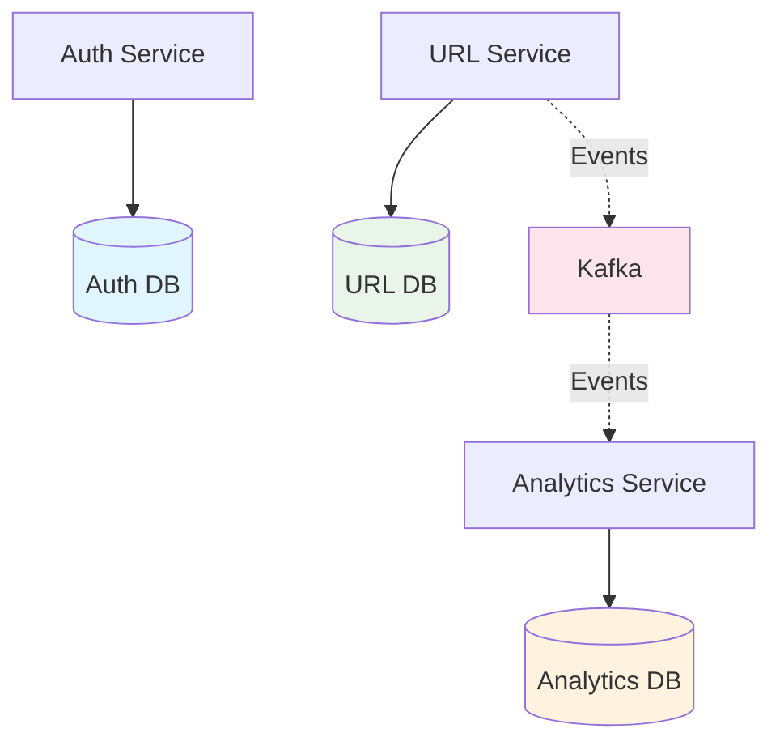
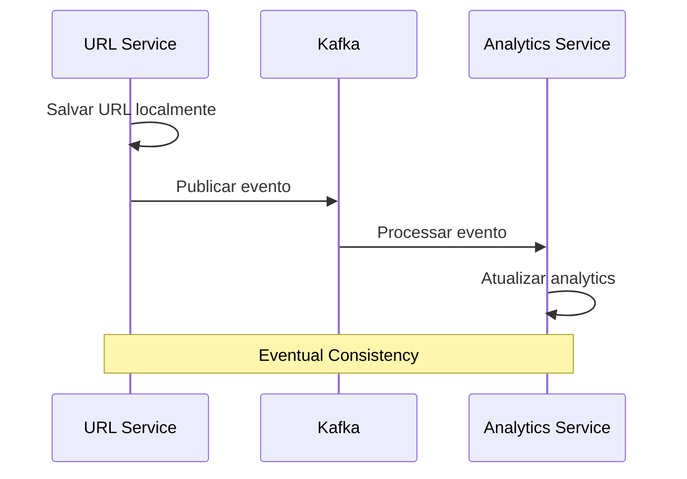

# Persistência Distribuída em Arquitetura de Microsserviços

## Visão Geral

Este documento explica como implementamos persistência distribuída seguindo o padrão **Database per Service**, onde cada microsserviço possui seu próprio banco de dados independente. Esta abordagem garante baixo acoplamento e alta coesão entre os serviços.

## Arquitetura de Persistência



## Padrões de Microsserviços Implementados

### 1. Database per Service

Cada serviço possui seu próprio banco de dados com esquemas específicos:

#### Serviço de Autenticação
```typescript
// apps/auth/src/db/schema.ts
export const users = pgTable('users', {
  id: text('id').primaryKey().$defaultFn(() => createId()),
  email: text('email').notNull().unique(),
  passwordHash: text('password_hash').notNull(),
  firstName: text('first_name'),
  lastName: text('last_name'),
  isActive: boolean('is_active').default(true),
  createdAt: timestamp('created_at').defaultNow().notNull(),
  updatedAt: timestamp('updated_at').defaultNow().notNull(),
})

export const refreshTokens = pgTable('refresh_tokens', {
  id: text('id').primaryKey().$defaultFn(() => createId()),
  userId: text('user_id').references(() => users.id, { onDelete: 'cascade' }),
  token: text('token').notNull().unique(),
  expiresAt: timestamp('expires_at').notNull(),
  createdAt: timestamp('created_at').defaultNow().notNull(),
  revokedAt: timestamp('revoked_at'),
})
```

#### Serviço URL Shortener
```typescript
// apps/url-shortener/src/db/schema.ts
export const urls = pgTable('urls', {
  id: text('id').primaryKey().$defaultFn(() => createId()),
  originalUrl: text('original_url').notNull(),
  shortCode: text('short_code').notNull().unique(),
  clickCount: integer('click_count').default(0),
  createdAt: timestamp('created_at').defaultNow().notNull(),
})
```

#### Serviço Analytics
```typescript
// apps/analytics/src/db/schema.ts
export const clicks = pgTable('clicks', {
  id: text('id').primaryKey().$defaultFn(() => createId()),
  shortCode: text('short_code').notNull(),
  userAgent: text('user_agent'),
  ipAddress: text('ip_address'),
  country: text('country'),
  city: text('city'),
  referer: text('referer'),
  metadata: jsonb('metadata'),
  clickedAt: timestamp('clicked_at').defaultNow().notNull(),
})

export const urlStats = pgTable('url_stats', {
  id: text('id').primaryKey().$defaultFn(() => createId()),
  shortCode: text('short_code').notNull().unique(),
  totalClicks: integer('total_clicks').default(0),
  uniqueClicks: integer('unique_clicks').default(0),
})
```

### 2. Eventual Consistency

Como cada serviço tem seu próprio banco, utilizamos eventos assíncronos para manter consistência eventual:



### 3. Independent Schema Evolution

Cada serviço evolui seu schema independentemente usando Drizzle ORM, permitindo deploys isolados e evitando acoplamento entre serviços.

## Implementação dos Padrões

### 1. Isolamento de Dados

Cada serviço possui:
- **Banco dedicado**: PostgreSQL isolado com porta específica
- **Schema próprio**: Definições independentes sem foreign keys entre serviços
- **Migrações independentes**: `npm run db:generate && npm run db:migrate` por serviço

### 2. Transactional Boundaries

Transações ACID limitadas ao contexto de cada serviço, comunicação entre serviços via eventos assíncronos para manter consistência eventual.

## Desafios e Soluções

### 1. Consistency Trade-offs

- **Dentro do serviço**: ACID transactions garantem consistência forte
- **Entre serviços**: Eventual consistency via eventos assíncronos
- **Implementação**: Analytics service reconstrói estado a partir de eventos (`url_creations` table)

## Vantagens para Microsserviços

### 1. Autonomia dos Serviços
- **Independent Deployment**: Cada serviço pode ser deployado independentemente
- **Technology Diversity**: Cada serviço pode usar diferentes tecnologias de banco
- **Schema Evolution**: Mudanças de schema não afetam outros serviços

### 2. Escalabilidade
- **Horizontal Scaling**: Cada banco pode ser escalado independentemente
- **Performance Isolation**: Performance de um serviço não afeta outros
- **Resource Optimization**: Recursos alocados conforme demanda específica

### 3. Resilência
- **Failure Isolation**: Falha em um banco não afeta outros serviços
- **Recovery Independence**: Recuperação pode ser feita por serviço
- **Backup Strategies**: Estratégias específicas para cada contexto de dados

### 2. Referential Integrity

Utilizamos soft references (IDs) ao invés de foreign keys entre serviços, mantendo integridade via eventual consistency e compensating transactions quando necessário.

A persistência distribuída é fundamental para manter a autonomia dos microsserviços, permitindo evolução independente mantendo consistência via padrões de eventual consistency.