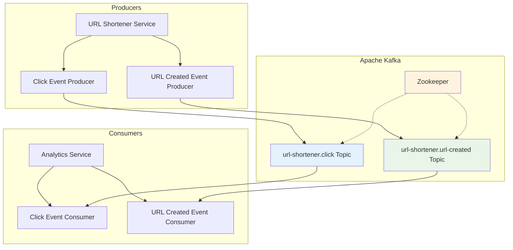
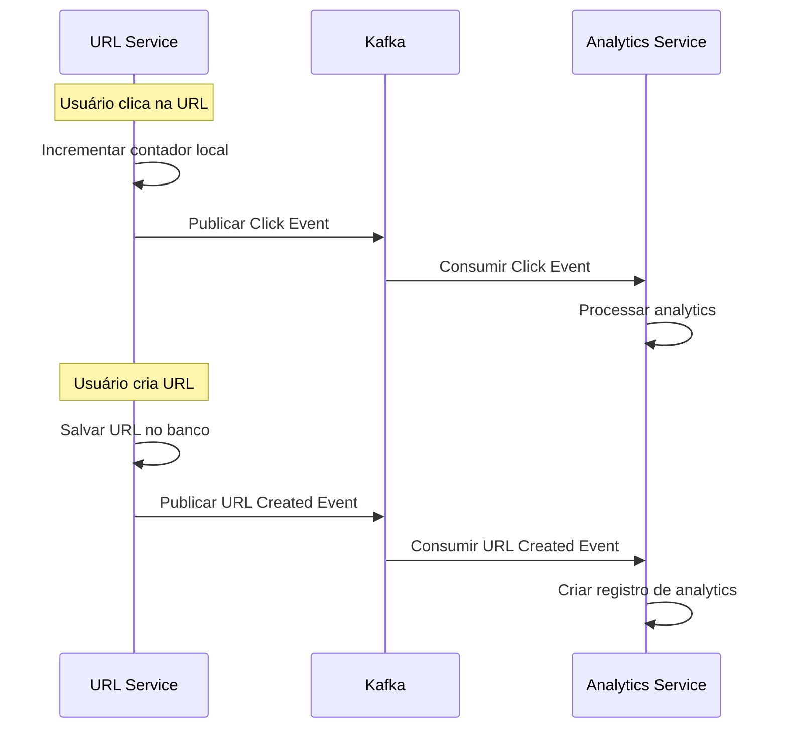

# Comunicação Assíncrona em Arquitetura de Microsserviços

## Visão Geral

Este documento explica como implementamos comunicação assíncrona entre microsserviços utilizando Apache Kafka. Esta abordagem implementa os padrões **Event-Driven Architecture** e **Publish-Subscribe** para garantir baixo acoplamento e alta escalabilidade.

## Arquitetura de Comunicação



## Padrões de Microsserviços Implementados

### 1. Event-Driven Architecture

Os serviços comunicam-se através de eventos de domínio, não chamadas diretas:



### 2. Publish-Subscribe Pattern

Produtores publicam eventos sem conhecer os consumidores:

```typescript
// apps/url-shortener/src/lib/kafka/producers/click-event-producer.ts
export const publishClickEvent: EventPublisher<ClickEventPayload> = async (payload) => {
  await kafkaProducer.publishEvent('url-shortener.click', payload)
}
```

### 3. Message Contracts

Contratos tipados garantem compatibilidade entre serviços:

```typescript
// contracts/events/url-shortener/click-event.ts
export const ClickEventPayload = z.object({
  shortCode: z.string().describe('The short code that was clicked'),
  originalUrl: z.string().url().describe('The target URL'),
  userAgent: z.string().optional().describe('Browser user agent'),
  ipAddress: z.string().optional().describe('Client IP address'),
  country: z.string().optional().describe('User country from headers'),
  city: z.string().optional().describe('User city from headers'),
  referer: z.string().optional().describe('Referrer URL'),
  timestamp: z.string().datetime().describe('When the click occurred'),
  userId: z.string().optional().describe('Authenticated user ID'),
  metadata: z.record(z.any()).optional().describe('Additional context'),
})
```

## Implementação dos Produtores

### 1. Configuração do Kafka Producer

```typescript
// shared/kafka/producer.ts
export class KafkaProducer {
  private producer: Producer

  constructor(private brokers: string[]) {
    const kafka = new Kafka({
      clientId: 'url-shortener-producer',
      brokers: this.brokers,
    })
    this.producer = kafka.producer()
  }

  async publishEvent<T>(topic: string, payload: T): Promise<void> {
    await this.producer.send({
      topic,
      messages: [
        {
          partition: 0,
          key: randomUUID(),
          value: JSON.stringify(payload),
        },
      ],
    })
  }
}
```

### 2. Produtores Específicos por Evento

#### Click Event Producer
```typescript
// apps/url-shortener/src/lib/kafka/producers/click-event-producer.ts
import type { EventPublisher } from '@microservices/shared/kafka/events/types.ts'
import type { ClickEventPayload } from '@url-shortener/contracts'
import { kafkaProducer } from '../config.ts'

export const publishClickEvent: EventPublisher<ClickEventPayload> = async (payload) => {
  await kafkaProducer.publishEvent('url-shortener.click', payload)
}
```

#### URL Created Event Producer
```typescript
// apps/url-shortener/src/lib/kafka/producers/url-created-event-producer.ts
import type { EventPublisher } from '@microservices/shared/kafka/events/types.ts'
import type { UrlCreatedEventPayload } from '@url-shortener/contracts'
import { kafkaProducer } from '../config.ts'

export const publishUrlCreatedEvent: EventPublisher<UrlCreatedEventPayload> = async (payload) => {
  await kafkaProducer.publishEvent('url-shortener.url-created', payload)
}
```

### 3. Integração com Rotas

#### Publicação de Click Events
```typescript
// apps/url-shortener/src/routes/redirect-url.ts:39-63
// Publicar evento de click (fire-and-forget)
publishClickEvent({
  shortCode,
  originalUrl: url.originalUrl,
  userAgent: request.headers['user-agent'],
  ipAddress: request.ip,
  country: Array.isArray(request.headers['cf-ipcountry'])
    ? request.headers['cf-ipcountry'][0]
    : request.headers['cf-ipcountry'],
  city: Array.isArray(request.headers['cf-ipcity'])
    ? request.headers['cf-ipcity'][0]
    : request.headers['cf-ipcity'],
  referer: request.headers.referer,
  timestamp: new Date().toISOString(),
  userId: Array.isArray(request.headers['x-user-id'])
    ? request.headers['x-user-id'][0]
    : request.headers['x-user-id'],
  metadata: {
    host: request.headers.host,
    acceptLanguage: request.headers['accept-language'],
  },
}).catch((error) => {
  console.error('Failed to publish click event:', error)
})
```

#### Publicação de URL Created Events
```typescript
// apps/url-shortener/src/routes/create-url.ts:73-89
publishUrlCreatedEvent({
  eventId: createId(),
  urlId: createdUrl.id,
  shortCode: createdUrl.shortCode,
  originalUrl: createdUrl.originalUrl,
  userId,
  createdAt: createdUrl.createdAt.toISOString(),
  metadata: {
    host: request.headers.host,
    userAgent: request.headers['user-agent'],
    ipAddress: request.ip,
  },
}).catch((error) => {
  console.error('Failed to publish URL creation event:', error)
})
```

## Implementação dos Consumidores

### 1. Configuração do Kafka Consumer

```typescript
// shared/kafka/consumer.ts
export class KafkaConsumer {
  private consumer: Consumer

  constructor(
    private brokers: string[],
    private groupId: string
  ) {
    const kafka = new Kafka({
      clientId: 'analytics-consumer',
      brokers: this.brokers,
    })
    this.consumer = kafka.consumer({ groupId: this.groupId })
  }

  async subscribe(topics: string[]): Promise<void> {
    await this.consumer.subscribe({ topics })
  }

  async start(handlers: Record<string, EventHandler<any>>): Promise<void> {
    await this.consumer.run({
      eachMessage: async ({ topic, message }) => {
        const handler = handlers[topic]
        if (handler && message.value) {
          const payload = JSON.parse(message.value.toString())
          await handler(payload)
        }
      },
    })
  }
}
```

### 2. Consumidores Específicos por Evento

#### Click Event Consumer
```typescript
// apps/analytics/src/lib/kafka/consumers/click-event-consumer.ts
export const clickHandler: EventHandler<ClickEventPayload> = async (payload) => {
  console.log('Processing click event:', payload)

  try {
    // Registrar click no banco de dados
    await db.insert(clicks).values({
      shortCode: payload.shortCode,
      userAgent: payload.userAgent,
      ipAddress: payload.ipAddress,
      country: payload.country,
      city: payload.city,
      referer: payload.referer,
      clickedAt: new Date(payload.timestamp),
      metadata: payload.metadata,
    })

    // Atualizar estatísticas agregadas
    await db
      .insert(urlStats)
      .values({
        shortCode: payload.shortCode,
        totalClicks: 1,
        uniqueClicks: 1,
      })
      .onConflictDoUpdate({
        target: urlStats.shortCode,
        set: {
          totalClicks: sql`${urlStats.totalClicks} + 1`,
        },
      })

    console.log(`Click recorded for ${payload.shortCode}`)
  } catch (error) {
    console.error('Error processing click event:', error)
    throw error
  }
}
```

#### URL Created Event Consumer (com Idempotência)
```typescript
// apps/analytics/src/lib/kafka/consumers/url-created-event-consumer.ts:8-54
export const urlCreatedHandler: EventHandler<UrlCreatedEventPayload> = async (payload) => {
  console.log('Processing URL creation event:', payload)

  try {
    await db.transaction(async (tx) => {
      // Verificar se evento já foi processado
      const existingEvent = await tx
        .select()
        .from(processedEvents)
        .where(sql`${processedEvents.eventId} = ${payload.eventId}`)
        .limit(1)

      if (existingEvent.length > 0) {
        console.log(`Event ${payload.eventId} already processed, skipping`)
        return
      }

      // Marcar evento como processado
      await tx.insert(processedEvents).values({
        eventId: payload.eventId,
        eventType: 'url-shortener.url-created',
        processedAt: new Date(),
        ttlExpiresAt: new Date(Date.now() + 30 * 24 * 60 * 60 * 1000),
      })

      // Inserir registro de criação de URL
      await tx.insert(urlCreations).values({
        eventId: payload.eventId,
        urlId: payload.urlId,
        shortCode: payload.shortCode,
        originalUrl: payload.originalUrl,
        userId: payload.userId,
        createdAt: new Date(payload.createdAt),
        metadata: payload.metadata,
      })
    })
  } catch (error) {
    console.error('Error processing URL creation event:', error)
    throw error
  }
}
```

### 3. Registro e Inicialização dos Consumidores

```typescript
// apps/analytics/src/lib/kafka/consumers/index.ts
export const eventConsumers = {
  'url-shortener.click': clickEventConsumer,
  'url-shortener.url-created': urlCreatedEventConsumer,
}

export const eventHandlers = {
  'url-shortener.click': clickHandler,
  'url-shortener.url-created': urlCreatedHandler,
}
```

## Contratos de Eventos

### 1. Estrutura dos Contratos

```typescript
// contracts/events/url-shortener/url-created-event.ts
export const UrlCreatedEventPayload = z.object({
  eventId: z.string().describe('Unique event identifier for idempotency'),
  urlId: z.string().describe('The created URL unique identifier'),
  shortCode: z.string().describe('Generated short code'),
  originalUrl: z.string().url().describe('Target URL'),
  userId: z.string().optional().describe('User who created the URL'),
  createdAt: z.string().datetime().describe('URL creation timestamp'),
  metadata: z.record(z.any()).optional().describe('Additional context'),
})

export type UrlCreatedEventPayload = z.infer<typeof UrlCreatedEventPayload>
```

### 2. Versionamento de Contratos

```typescript
// contracts/events/url-shortener/index.ts
export { ClickEventPayload } from './click-event.ts'
export { UrlCreatedEventPayload } from './url-created-event.ts'

// Possível versionamento futuro:
// export { ClickEventPayloadV2 } from './click-event-v2.ts'
```

## Vantagens da Comunicação Assíncrona

### 1. Baixo Acoplamento
```mermaid
graph LR
    A[URL Service] -.->|Events| B[Kafka]
    B -.->|Events| C[Analytics Service]
    B -.->|Events| D[Future Service]
    
    Note: "Serviços não se conhecem diretamente"
```

- **Temporal Decoupling**: Produtores e consumidores não precisam estar online simultaneamente
- **Service Independence**: Novos consumidores podem ser adicionados sem modificar produtores
- **Technology Diversity**: Cada serviço pode usar tecnologias diferentes

### 2. Escalabilidade

#### Horizontal Scaling
```typescript
// Múltiplas instâncias do analytics service podem consumir do mesmo tópico
const consumer = new KafkaConsumer(
  ['kafka:9092'],
  'analytics-service-group' // Consumer group para load balancing
)
```

#### Throughput
- **Parallelism**: Múltiplos consumidores processam mensagens em paralelo
- **Batching**: Kafka processa mensagens em lotes para maior eficiência
- **Partitioning**: Tópicos podem ser particionados para distribuir carga

### 3. Resilência

#### Fault Tolerance
```typescript
// Error handling com retry automático
await publishClickEvent(payload).catch((error) => {
  console.error('Failed to publish click event:', error)
  // Em produção: enviar para dead letter queue ou retry queue
})
```

#### Message Durability
- **Persistence**: Mensagens são persistidas em disco
- **Replication**: Mensagens replicadas entre brokers
- **Retention**: Mensagens mantidas por período configurável

## Patterns de Tratamento de Erros

### 1. Fire-and-Forget

Para eventos não críticos:
```typescript
publishClickEvent(payload).catch((error) => {
  console.error('Failed to publish click event:', error)
  // Log error but don't block user experience
})
```

### 2. Retry com Exponential Backoff

```typescript
async function publishWithRetry<T>(
  publisher: EventPublisher<T>,
  payload: T,
  maxRetries = 3
): Promise<void> {
  for (let attempt = 1; attempt <= maxRetries; attempt++) {
    try {
      await publisher(payload)
      return
    } catch (error) {
      if (attempt === maxRetries) throw error
      
      const delay = Math.pow(2, attempt) * 1000 // Exponential backoff
      await new Promise(resolve => setTimeout(resolve, delay))
    }
  }
}
```

### 3. Dead Letter Queue Pattern

```typescript
// Para mensagens que falharam após múltiplas tentativas
const deadLetterConsumer = {
  eventType: 'url-shortener.click.deadletter',
  handler: async (payload) => {
    // Log para investigação
    console.error('Dead letter message:', payload)
    // Alertar equipe de desenvolvimento
    // Possível reprocessamento manual
  }
}
```

## Monitoramento e Observabilidade

### 1. Métricas de Produção

```typescript
// Exemplo de métricas personalizadas
export class ProducerMetrics {
  static incrementPublished(topic: string) {
    // Incrementar contador de mensagens publicadas
  }
  
  static recordLatency(topic: string, latency: number) {
    // Registrar latência de publicação
  }
}
```

### 2. Consumer Lag Monitoring

```bash
# Monitorar lag dos consumidores
kafka-consumer-groups --bootstrap-server localhost:9092 --describe --group analytics-service-group
```

### 3. Health Checks

```typescript
export async function checkKafkaHealth(): Promise<HealthStatus> {
  try {
    // Tentar conectar ao Kafka
    await kafkaProducer.ping()
    return { status: 'healthy', service: 'kafka' }
  } catch (error) {
    return { status: 'unhealthy', service: 'kafka', error: error.message }
  }
}
```

A comunicação assíncrona via Kafka é essencial para arquiteturas de microsserviços escaláveis, fornecendo baixo acoplamento, alta disponibilidade e capacidade de evolução independente dos serviços.