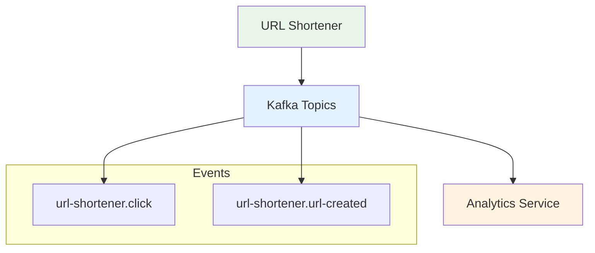
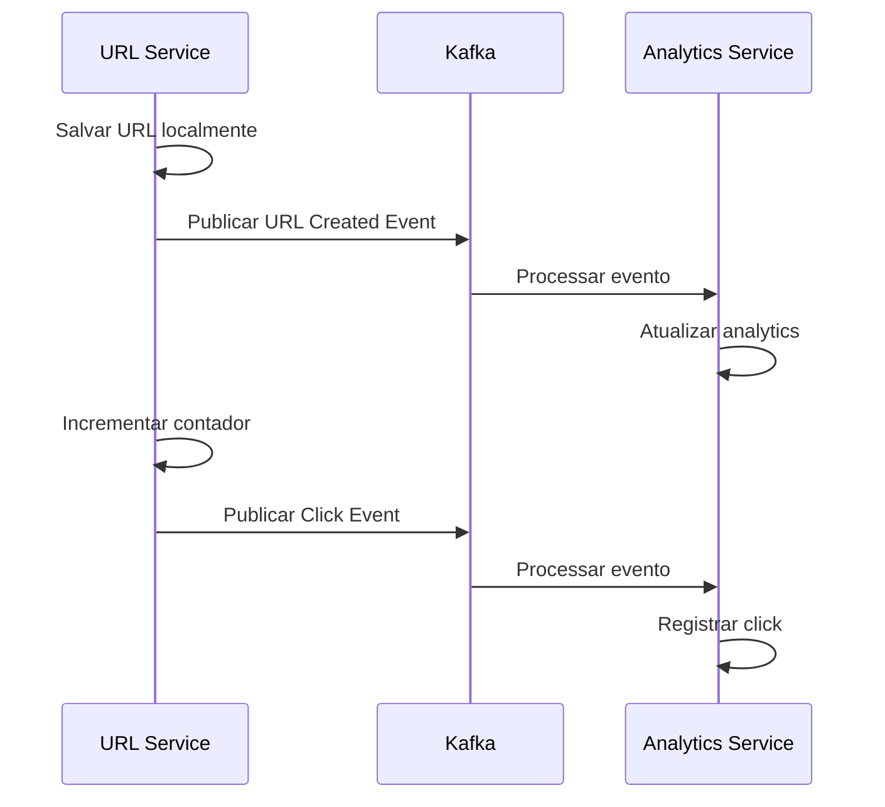

# Comunicação Assíncrona em Arquitetura de Microsserviços

## Visão Geral

Este documento explica como implementamos comunicação assíncrona entre microsserviços utilizando Apache Kafka. Esta abordagem implementa os padrões **Event-Driven Architecture** e **Publish-Subscribe** para garantir baixo acoplamento e alta escalabilidade.

## Arquitetura de Comunicação

## Padrões de Microsserviços Implementados

### 1. Event-Driven Architecture

Os serviços comunicam-se através de eventos de domínio, não chamadas diretas:

### 2. Publish-Subscribe Pattern

Produtores publicam eventos sem conhecer consumidores. Implementado através de produtores específicos (`apps/url-shortener/src/lib/kafka/producers/`) e consumidores específicos (`apps/analytics/src/lib/kafka/consumers/`).

### 3. Message Contracts

Contratos tipados com Zod garantem compatibilidade entre serviços, definidos em `contracts/events/url-shortener/` e compartilhados entre producer e consumer.

## Implementação dos Padrões

### 1. Fire-and-Forget Publishing

Eventos são publicados de forma assíncrona sem bloquear a resposta ao usuário:
- **Click Events**: Publicados após redirect (`apps/url-shortener/src/routes/redirect-url.ts:39-63`)
- **URL Created Events**: Publicados após salvar URL (`apps/url-shortener/src/routes/create-url.ts:73-89`)

### 2. Producer por Tipo de Evento

Cada tipo de evento possui seu próprio producer em `apps/url-shortener/src/lib/kafka/producers/`, seguindo single responsibility principle.

## Implementação dos Consumidores

### 1. Consumer Groups

Analytics service usa consumer groups para load balancing e fault tolerance, permitindo múltiplas instâncias processarem mensagens em paralelo.

### 2. Consumer por Tipo de Evento

Cada tipo de evento possui seu próprio consumer em `apps/analytics/src/lib/kafka/consumers/`:
- **Click Consumer**: Registra clicks e atualiza estatísticas
- **URL Created Consumer**: Processa criação de URLs com idempotência

### 3. Error Handling e Retry

Consumers implementam error handling com retry automático via Kafka, garantindo que mensagens não sejam perdidas em caso de falhas temporárias.

## Vantagens para Microsserviços

### 1. Baixo Acoplamento
- **Temporal Decoupling**: Produtores e consumidores não precisam estar online simultaneamente
- **Service Independence**: Novos consumidores podem ser adicionados sem modificar produtores
- **Technology Diversity**: Cada serviço pode usar tecnologias diferentes

### 2. Escalabilidade
- **Horizontal Scaling**: Múltiplas instâncias do analytics service podem consumir em paralelo
- **Throughput**: Kafka processa mensagens em lotes para maior eficiência
- **Partitioning**: Tópicos podem ser particionados para distribuir carga

### 3. Resilência
- **Fault Tolerance**: Error handling com retry automático
- **Message Durability**: Mensagens persistidas e replicadas
- **Dead Letter Queues**: Tratamento de mensagens que falharam

### 4. Observabilidade
- **Consumer Lag Monitoring**: Monitoramento de latência entre producer e consumer
- **Event Tracing**: Rastreamento distribuído automático via OpenTelemetry
- **Health Checks**: Verificação de conectividade com Kafka

A comunicação assíncrona via Kafka é essencial para arquiteturas de microsserviços escaláveis, fornecendo baixo acoplamento e alta disponibilidade sem dependências síncronas entre serviços.