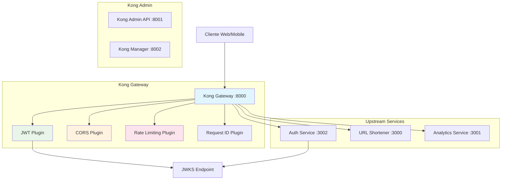
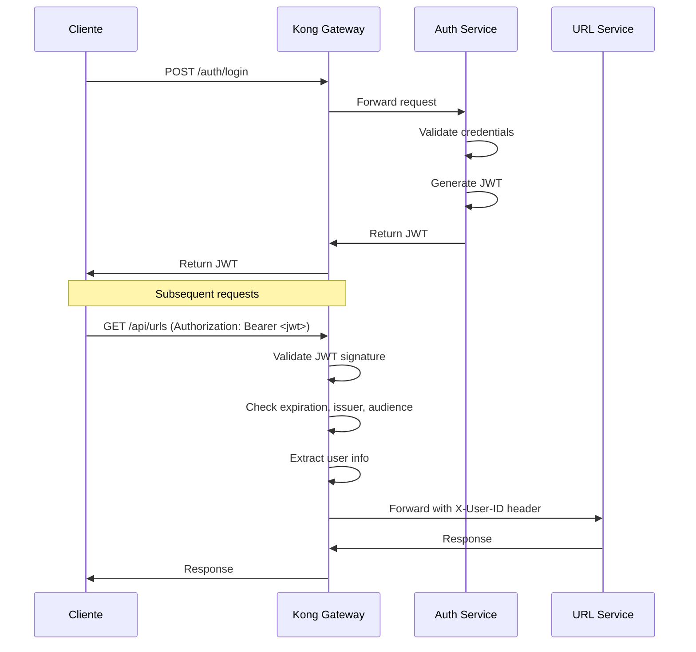
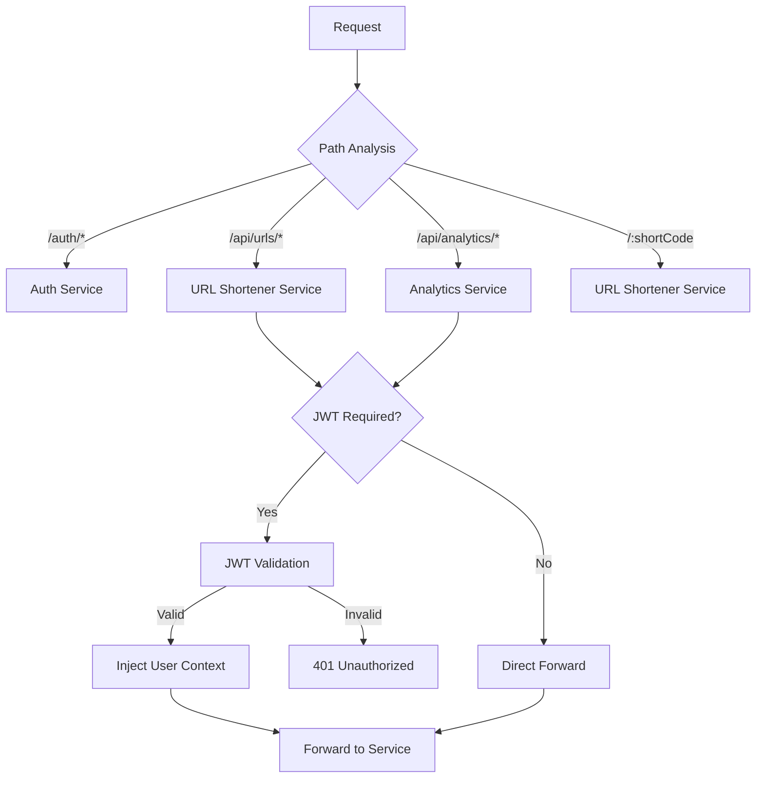
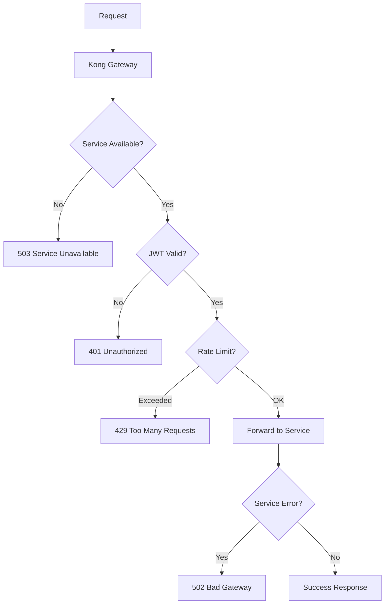

# API Gateway em Arquitetura de Microsserviços

## Visão Geral

Este documento explica como implementamos um API Gateway utilizando Kong para centralizar o roteamento, autenticação e políticas de acesso em uma arquitetura de microsserviços. O gateway implementa os padrões **Backend for Frontend (BFF)** e **Gateway Routing**.

## Arquitetura do API Gateway



## Padrões de Microsserviços Implementados

### 1. Gateway Routing Pattern

O Kong atua como ponto único de entrada, roteando requests para os serviços apropriados:

```yaml
# kong/kong.yml
services:
- name: auth-service
  url: http://host.docker.internal:3002
  routes:
  - name: auth-routes
    paths:
    - /auth
    - /.well-known

- name: url-shortener
  url: http://host.docker.internal:3000
  routes:
  - name: url-api-routes
    paths:
    - /api/urls
  - name: redirect-routes
    paths:
    - /

- name: analytics
  url: http://host.docker.internal:3001
  routes:
  - name: analytics-routes
    paths:
    - /api/analytics
```

### 2. Centralized Authentication

JWT validation é feita no gateway, não nos serviços downstream:

```yaml
# kong/kong.yml - JWT Plugin Configuration
plugins:
- name: jwt
  service: url-shortener
  config:
    key_claim_name: iss
    secret_is_base64: false
    run_on_preflight: true
    uri_param_names:
    - token
    cookie_names: []
    claims_to_verify:
    - exp
    - iss
    - aud
```

### 3. Cross-Cutting Concerns

Políticas aplicadas centralizadamente:

```yaml
# CORS Plugin
- name: cors
  config:
    origins:
    - "*"
    methods:
    - GET
    - POST
    - PUT
    - DELETE
    - OPTIONS
    headers:
    - Accept
    - Accept-Version
    - Content-Length
    - Content-MD5
    - Content-Type
    - Date
    - Authorization
    exposed_headers:
    - X-Auth-Token
    credentials: true
    max_age: 3600
```

## Configuração do Kong

### 1. Database-less Configuration

Utilizamos configuração declarativa sem banco de dados:

```yaml
# kong/kong.yml
_format_version: "3.0"
_transform: true

services:
- name: auth-service
  url: http://host.docker.internal:3002
  connect_timeout: 60000
  write_timeout: 60000
  read_timeout: 60000
  
- name: url-shortener
  url: http://host.docker.internal:3000
  connect_timeout: 60000
  write_timeout: 60000
  read_timeout: 60000
  
- name: analytics
  url: http://host.docker.internal:3001
  connect_timeout: 60000
  write_timeout: 60000
  read_timeout: 60000
```

### 2. Docker Compose Integration

```yaml
# docker-compose.yml
kong:
  image: kong:3.4
  environment:
    KONG_DATABASE: "off"
    KONG_DECLARATIVE_CONFIG: /kong/kong.yml
    KONG_PROXY_ACCESS_LOG: /dev/stdout
    KONG_ADMIN_ACCESS_LOG: /dev/stdout
    KONG_PROXY_ERROR_LOG: /dev/stderr
    KONG_ADMIN_ERROR_LOG: /dev/stderr
    KONG_ADMIN_LISTEN: "0.0.0.0:8001"
  volumes:
    - "./kong:/kong"
  ports:
    - "8000:8000"  # Proxy HTTP
    - "8001:8001"  # Admin API
    - "8002:8002"  # Manager UI
  depends_on:
    - auth-db
    - url-shortener-db
    - analytics-db
```

## Funcionalidades Implementadas

### 1. Roteamento Inteligente

#### Roteamento por Path
```yaml
# URLs públicas (sem autenticação)
- name: redirect-routes
  paths:
  - /
  strip_path: false
  
# APIs protegidas
- name: url-api-routes
  paths:
  - /api/urls
  strip_path: false
```

#### Roteamento por Host
```yaml
# Possível configuração multi-tenant
routes:
- name: tenant-a-routes
  hosts:
  - tenant-a.example.com
  service: url-shortener
  
- name: tenant-b-routes
  hosts:
  - tenant-b.example.com
  service: url-shortener-b
```

### 2. Autenticação JWT

#### Configuração do Plugin JWT
```yaml
plugins:
- name: jwt
  service: url-shortener
  config:
    key_claim_name: iss
    secret_is_base64: false
    run_on_preflight: true
    claims_to_verify:
    - exp  # Token expiration
    - iss  # Issuer verification
    - aud  # Audience verification
```

#### Integração com JWKS
O Kong busca chaves públicas do serviço de autenticação:

```typescript
// apps/auth/src/routes/get-jwks.ts:11-29
export const getJwks: FastifyPluginAsyncZod = async (fastify) => {
  fastify.get(
    '/.well-known/jwks.json',
    {
      schema: {
        response: {
          200: JwksResponseSchema,
        },
      },
    },
    async (request, reply) => {
      const publicKey = await getJwtPublicKey()
      const jwk = await jose.exportJWK(publicKey)
      
      return reply.send({
        keys: [
          {
            ...jwk,
            kid: 'main',
            use: 'sig',
            alg: 'HS256',
          },
        ],
      })
    }
  )
}
```

### 3. Injeção de Contexto

O Kong injeta informações do usuário autenticado:

```yaml
# Headers injetados pelo Kong após validação JWT
X-Consumer-ID: <consumer-id>
X-Consumer-Username: <username>
X-Anonymous-Consumer: <boolean>
X-User-ID: <user-id-from-jwt>
```

#### Utilização nos Serviços
```typescript
// apps/url-shortener/src/routes/create-url.ts:19-21
headers: z.object({
  'x-user-id': z.string(),
}),

// apps/url-shortener/src/routes/create-url.ts:36
const userId = request.headers['x-user-id']
```

### 4. Políticas de Segurança

#### Rate Limiting
```yaml
plugins:
- name: rate-limiting
  config:
    minute: 100
    hour: 1000
    policy: local
    hide_client_headers: false
```

#### Request/Response Transformation
```yaml
plugins:
- name: request-transformer
  config:
    add:
      headers:
      - "X-Request-ID:$(uuid)"
      - "X-Forwarded-For:$(client_ip)"
```

## Fluxos de Processamento

### 1. Fluxo de Autenticação



### 2. Fluxo de Roteamento



### 3. Fluxo de Error Handling



## Monitoramento e Observabilidade

### 1. Logs Centralizados

```yaml
# kong/kong.yml - Logging plugin
plugins:
- name: file-log
  config:
    path: /dev/stdout
    
- name: http-log
  config:
    http_endpoint: http://logstash:8080
    method: POST
    timeout: 1000
    keepalive: 1000
```

### 2. Métricas e Dashboards

#### Kong Admin API
```bash
# Verificar status dos serviços
curl -X GET http://localhost:8001/services

# Verificar status das rotas
curl -X GET http://localhost:8001/routes

# Verificar plugins ativos
curl -X GET http://localhost:8001/plugins
```

#### Kong Manager UI
Acesso via `http://localhost:8002` para:
- Visualizar configuração dos serviços
- Monitorar tráfego em tempo real
- Configurar plugins graficamente
- Gerenciar certificados SSL

### 3. Health Checks

```yaml
# Configuração de health checks
services:
- name: url-shortener
  url: http://host.docker.internal:3000
  healthchecks:
    active:
      type: http
      http_path: /health
      healthy:
        interval: 5
        successes: 1
      unhealthy:
        interval: 5
        http_failures: 3
        tcp_failures: 3
        timeouts: 3
```

## Vantagens do API Gateway

### 1. Centralized Cross-Cutting Concerns
- **Authentication**: Validação JWT centralizada
- **Authorization**: Políticas de acesso uniformes
- **Rate Limiting**: Proteção contra abuso
- **CORS**: Configuração centralizada para SPAs
- **Logging**: Auditoria de todos os requests

### 2. Service Discovery e Load Balancing
```yaml
# Load balancing entre múltiplas instâncias
services:
- name: url-shortener
  url: http://url-shortener-cluster
  targets:
  - target: url-shortener-1:3000
    weight: 100
  - target: url-shortener-2:3000
    weight: 100
```

### 3. API Versioning
```yaml
# Versionamento via headers
routes:
- name: url-api-v1
  paths:
  - /api/v1/urls
  service: url-shortener-v1
  
- name: url-api-v2
  paths:
  - /api/v2/urls
  service: url-shortener-v2
```

### 4. Protocol Translation
```yaml
# Exemplo: HTTP to gRPC
services:
- name: grpc-service
  url: grpc://internal-service:9000
  protocol: grpc
  routes:
  - name: grpc-route
    paths:
    - /api/grpc
```

## Considerações de Performance

### 1. Caching
```yaml
plugins:
- name: proxy-cache
  config:
    content_type:
    - "application/json"
    cache_ttl: 300
    strategy: memory
```

### 2. Connection Pooling
```yaml
# Configuração de connection pooling
services:
- name: url-shortener
  url: http://host.docker.internal:3000
  connect_timeout: 60000
  write_timeout: 60000
  read_timeout: 60000
  retries: 3
```

### 3. Circuit Breaker
```yaml
# Implementação de circuit breaker
plugins:
- name: request-termination
  config:
    status_code: 503
    message: "Service temporarily unavailable"
  # Ativado quando serviço falha consistentemente
```

## Segurança Avançada

### 1. IP Whitelisting
```yaml
plugins:
- name: ip-restriction
  config:
    allow:
    - 192.168.1.0/24
    - 10.0.0.0/8
```

### 2. OAuth2 Integration
```yaml
plugins:
- name: oauth2
  config:
    scopes:
    - email
    - profile
    mandatory_scope: true
    token_expiration: 3600
```

### 3. mTLS (Mutual TLS)
```yaml
# Configuração de certificados cliente
services:
- name: secure-service
  url: https://secure-backend:8443
  client_certificate:
    id: client-cert-id
```

O API Gateway Kong fornece uma camada robusta de abstração e controle, essencial para gerenciar a complexidade e segurança em arquiteturas de microsserviços distribuídas.