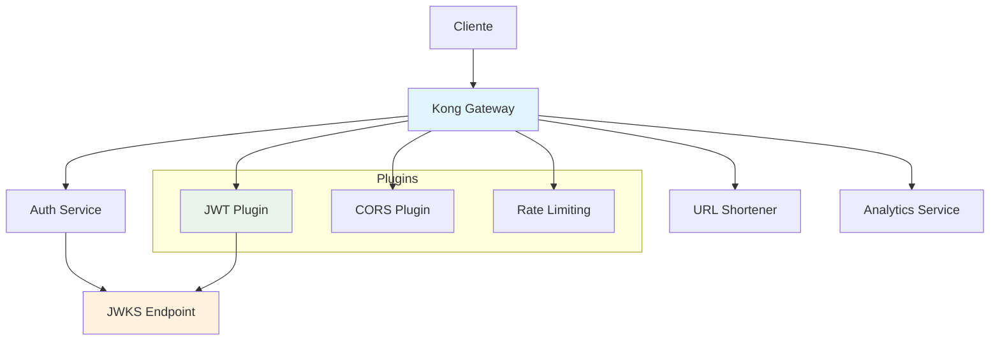
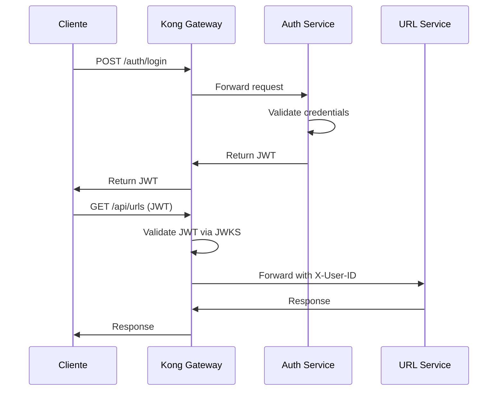

# API Gateway em Arquitetura de Microsserviços

## Visão Geral

Este documento explica como implementamos um API Gateway utilizando Kong para centralizar o roteamento, autenticação e políticas de acesso em uma arquitetura de microsserviços. O gateway implementa os padrões **Backend for Frontend (BFF)** e **Gateway Routing**.

## Arquitetura do API Gateway

## Padrões de Microsserviços Implementados

### 1. Gateway Routing Pattern

Kong atua como ponto único de entrada, roteando requests para serviços baseado em paths:
- `/auth/*` → Auth Service
- `/api/urls/*` → URL Shortener Service  
- `/api/analytics/*` → Analytics Service
- `/:shortCode` → URL Shortener Service (redirects)

### 2. Centralized Authentication

JWT validation é feita no gateway usando JWKS, eliminando necessidade de validação nos serviços downstream. Kong verifica assinatura, expiração e claims automaticamente.

### 3. Cross-Cutting Concerns

Políticas aplicadas centralizadamente:
- **CORS**: Configuração para SPAs
- **Rate Limiting**: Proteção contra abuso
- **Request ID**: Rastreamento de requests
- **Logging**: Auditoria centralizada

## Implementação dos Padrões

### 1. Database-less Configuration

Kong utiliza configuração declarativa via arquivo YAML (`kong/kong.yml`) sem necessidade de banco de dados, simplificando deployment e versionamento de configurações.

### 2. Service Discovery

Kong é configurado para descobrir serviços via host networking, permitindo comunicação com serviços rodando localmente durante desenvolvimento.

## Fluxos de Processamento

### 1. Fluxo de Autenticação

### 2. Context Injection

Kong injeta contexto do usuário autenticado via headers (`X-User-ID`, `X-Consumer-ID`) permitindo que serviços downstream recebam informações de autenticação sem implementar validação JWT.

## Vantagens para Microsserviços

### 1. Single Point of Entry
- **Centralized Authentication**: Validação JWT em um ponto único
- **Cross-Cutting Concerns**: CORS, rate limiting, logging aplicados centralizadamente
- **Request Routing**: Roteamento inteligente baseado em paths e headers

### 2. Service Abstraction
- **Client Simplification**: Clientes interagem com uma única URL
- **Service Discovery**: Kong descobre e roteia para serviços automaticamente
- **Load Balancing**: Distribuição de carga entre múltiplas instâncias

### 3. Security e Compliance
- **Early Rejection**: Requests inválidos bloqueados antes dos serviços
- **Centralized Policies**: Políticas de segurança aplicadas uniformemente
- **Audit Trail**: Logs centralizados para auditoria e compliance

O API Gateway Kong fornece abstração e controle essencial para gerenciar complexidade e segurança em arquiteturas de microsserviços distribuídas, permitindo que serviços downstream foquem em lógica de negócio.