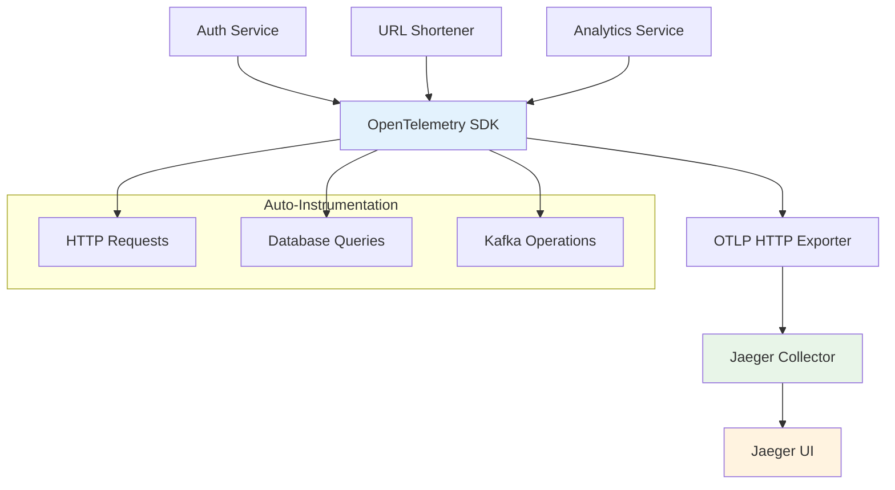

# Rastreamento Distribuído em Arquitetura de Microsserviços

## Visão Geral

Este documento explica como implementamos rastreamento distribuído utilizando OpenTelemetry e Jaeger para monitorar requests que atravessam múltiplos microsserviços. Esta implementação segue os padrões **Distributed Tracing** e **Observability** fundamentais para debugging e performance monitoring em arquiteturas distribuídas.

## Arquitetura de Observabilidade

## Padrões de Microsserviços Implementados

### 1. Distributed Tracing Pattern

Cada request gera um trace único que percorre todos os serviços, permitindo rastreamento end-to-end de operações distribuídas.

### 2. Context Propagation

Contexto de trace é automaticamente propagado entre serviços via headers HTTP, permitindo correlação de spans relacionados mesmo através de chamadas assíncronas.

### 3. Auto-Instrumentation

OpenTelemetry instrumenta automaticamente:
- **HTTP Requests**: Fastify routes e chamadas HTTP
- **Database Operations**: Queries PostgreSQL via driver `pg`
- **Kafka Operations**: Producers e consumers

## Implementação dos Padrões

### 1. Shared Tracing Configuration

Configuração centralizada em `shared/core/tracing.ts` utilizando OpenTelemetry SDK com OTLP HTTP exporter, garantindo consistência entre todos os serviços.

### 2. Service-Specific Initialization

Cada serviço inicializa tracing com nome e versão específicos via environment variables, permitindo identificação única no Jaeger UI.

### 3. Driver Migration para Observabilidade

Migramos de `postgres` para `pg` driver especificamente para habilitar auto-instrumentação de queries PostgreSQL, demonstrando como decisões técnicas impactam observabilidade.

## Vantagens para Microsserviços

### 1. End-to-End Visibility

Rastreamento completo de requests que atravessam múltiplos serviços, facilitando debugging de problemas em operações distribuídas.

### 2. Performance Analysis

Identificação de bottlenecks através de análise de spans, permitindo otimização direcionada de componentes específicos (database, HTTP, messaging).

### 3. Error Correlation

Correlação automática de erros com contexto completo da operação, incluindo serviços upstream e downstream envolvidos.

### 4. Service Dependency Mapping

Jaeger UI (http://localhost:16686) gera automaticamente mapas de dependência entre serviços, visualizando como requests fluem através da arquitetura distribuída.

### 5. OTLP HTTP Protocol

Utilizamos OTLP HTTP (porta 4318) como protocolo moderno para envio de traces, proporcionando melhor performance e padronização comparado a protocolos legados.

O rastreamento distribuído com OpenTelemetry e Jaeger é fundamental para manter visibilidade e debugar problemas em arquiteturas de microsserviços complexas, proporcionando insights sobre performance, erros e dependências entre serviços sem necessidade de instrumentação manual.