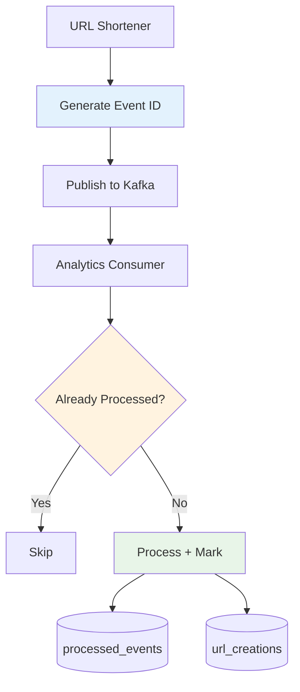

# Idempotência em Arquitetura de Microsserviços

## Visão Geral

Este documento explica como implementamos idempotência para garantir processamento exactly-once de eventos em uma arquitetura de microsserviços distribuída. Esta implementação utiliza os padrões **Idempotent Consumer** e **Event Deduplication** para prevenir processamento duplicado de mensagens.

## Arquitetura de Idempotência

## Padrões de Microsserviços Implementados

### 1. Idempotent Consumer Pattern

Analytics service processa eventos dentro de transações atômicas, verificando primeiro se o evento já foi processado antes de executar a lógica de negócio.

### 2. Event Deduplication

Cada evento inclui um `eventId` único (CUID2) gerado no producer, permitindo identificação e deduplicação no consumer.

### 3. Database Idempotency Table

Tabela `processed_events` rastreia eventos já processados, prevenindo processamento duplicado em cenários de retry ou múltiplas instâncias de consumer.

## Implementação dos Padrões

### 1. CUID2 para Event IDs

Utilizamos CUID2 para event IDs por ser collision-resistant, sortable, URL-safe e mais compacto que UUIDs, não requerendo coordenação central.

### 2. Atomic Transactions

Processamento idempotente implementado via transações atômicas que verificam existência do evento antes de processar, garantindo exactly-once semantics.

### 3. Database Schema para Idempotência

- **processed_events**: Tabela de controle com event_id como chave primária
- **url_creations**: Dados de negócio com referência ao event_id processado
- **TTL Support**: Cleanup automático de eventos antigos (30 dias)

## Vantagens para Microsserviços

### 1. Exactly-Once Processing

Garante que eventos sejam processados exatamente uma vez, mesmo em cenários de retry, multiple consumers ou falhas de rede.

### 2. Resilência a Falhas

- **Network Failures**: Redelivery não causa duplicação
- **Consumer Crashes**: Restart não reprocessa mensagens já tratadas
- **Race Conditions**: Múltiplas instâncias podem processar safely

### 3. Horizontal Scaling

Permite escalar horizontalmente consumers sem risco de processamento duplicado, essencial para high-throughput em microsserviços.

### 4. Data Consistency

Mantém consistência eventual entre serviços mesmo com failures parciais, utilizando database constraints e transações atômicas.

### 5. Observabilidade

APIs para monitoramento de idempotência (`/api/analytics/processed-events`, `/api/analytics/idempotency-stats`) fornecem visibilidade sobre processamento de eventos e taxas de deduplicação.

A implementação de idempotência é crucial para garantir consistência de dados em arquiteturas de microsserviços com comunicação assíncrona, prevenindo estados inconsistentes causados por processamento duplicado de eventos.