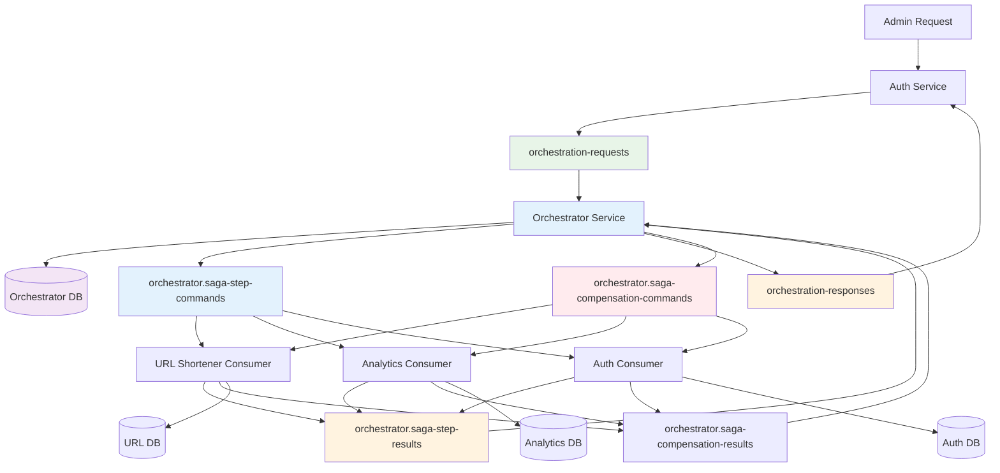
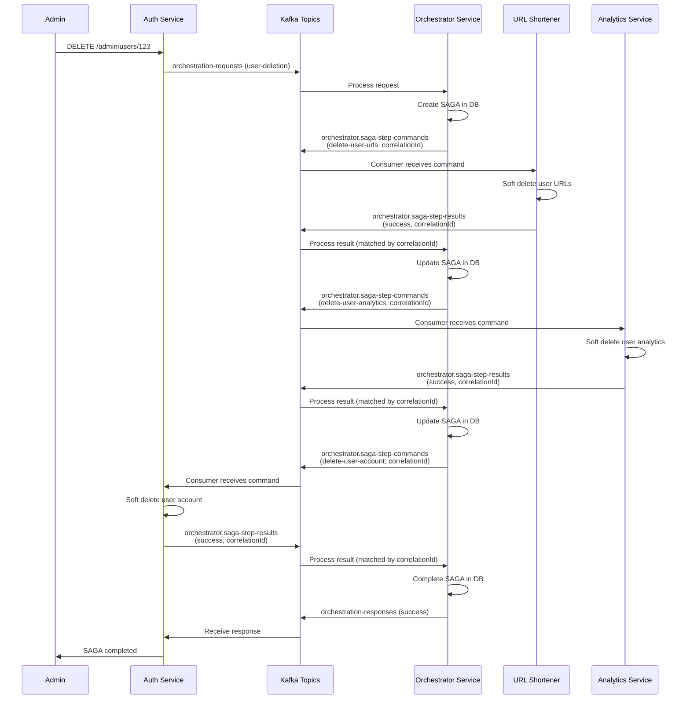
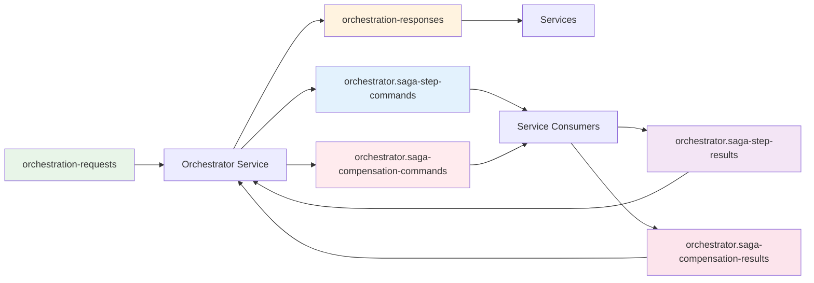
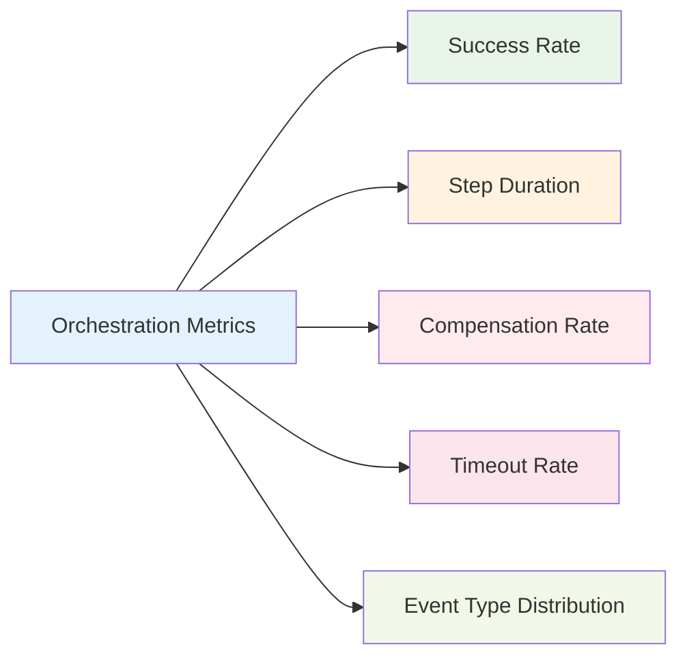
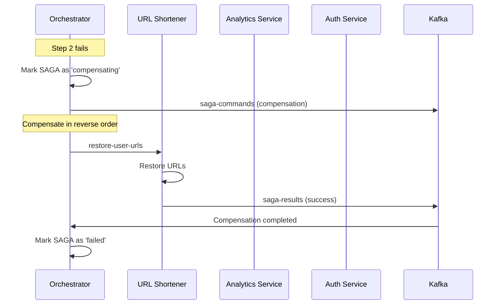

# Padrão SAGA com Kafka Orchestration em Microsserviços

## Visão Geral

Este documento explica como implementamos o padrão SAGA utilizando **comunicação 100% baseada em Kafka** com **database persistence** e **modular event handling**. Toda a comunicação entre o orquestrador e os serviços é feita através de tópicos Kafka, eliminando chamadas HTTP síncronas.

## Arquitetura do Padrão SAGA

### Arquitetura Kafka-Based com Orquestração Dedicada



### Fluxo de Comunicação Kafka-Based



## Componentes da Arquitetura

### 1. Orchestrator Service (Dedicated Microservice)

Um serviço dedicado para orquestração de SAGAs com persistência em banco de dados.

**Características:**
- **Database Persistence**: SAGAs persistidas em PostgreSQL
- **Event-Driven**: Comunicação 100% via Kafka
- **Modular Design**: Um handler por tipo de evento
- **Scalable**: Pode ser escalado independentemente

**Estrutura:**
```
apps/orchestrator/
├── src/
│   ├── orchestration/
│   │   ├── registry.ts           # Event registry
│   │   ├── events/
│   │   │   ├── user-deletion.ts  # User deletion handler
│   │   │   └── [new-events].ts   # Extensible for new events
│   │   └── index.ts
│   ├── saga/                     # SAGA infrastructure
│   └── server.ts                 # Main service
```

### 2. Kafka SAGA Service Client

Cliente Kafka para execução de steps via mensagens assíncronas.

**Características:**
- **Correlation IDs**: Correlação única para cada comando/resultado
- **Timeout Handling**: Timeout configurável por step
- **Type Safety**: Contratos TypeScript bem definidos
- **Async Communication**: Totalmente não-bloqueante
- **Result Matching**: Pareamento de comandos com resultados

### 3. Event Registry Pattern

Sistema modular para gerenciar handlers de eventos.

**Benefícios:**
- **Modularidade**: Um arquivo por tipo de evento
- **Extensibilidade**: Fácil adição de novos eventos
- **Type Safety**: Contratos bem definidos
- **Maintainability**: Código organizado e limpo

## Implementação Modular

### 1. Event Handler Structure with Kafka Communication

Cada tipo de evento tem seu próprio handler:

```typescript
// apps/orchestrator/src/orchestration/events/user-deletion.ts
export class UserDeletionOrchestrationHandler implements OrchestrationEventHandler {
  eventType = ORCHESTRATION_EVENTS.USER_DELETION
  
  async handle(request: OrchestrationRequest): Promise<{
    success: boolean
    sagaId?: string
    errorMessage?: string
  }> {
    // Define SAGA steps with Kafka-based communication
    const sagaDefinition = {
      type: SAGA_TYPES.USER_DELETION,
      timeout: 5 * 60 * 1000, // 5 minutes
      steps: [
        {
          stepNumber: 1,
          stepType: 'delete-user-urls',
          targetService: 'url-shortener',
          endpoint: 'url-shortener:delete-user-urls', // Kafka format
          method: 'KAFKA' as const,
          compensation: {
            endpoint: 'url-shortener:restore-user-urls',
            method: 'KAFKA' as const,
          },
        },
        {
          stepNumber: 2,
          stepType: 'delete-user-analytics',
          targetService: 'analytics',
          endpoint: 'analytics:delete-user-analytics',
          method: 'KAFKA' as const,
          compensation: {
            endpoint: 'analytics:restore-user-analytics',
            method: 'KAFKA' as const,
          },
        },
        {
          stepNumber: 3,
          stepType: 'delete-user-account',
          targetService: 'auth',
          endpoint: 'auth:delete-user-account',
          method: 'KAFKA' as const,
          compensation: {
            endpoint: 'auth:restore-user-account',
            method: 'KAFKA' as const,
          },
        },
      ]
    }
    
    // Execute SAGA via Kafka
    const result = await this.sagaOrchestrator.executeSaga(
      sagaDefinition, 
      request.businessId, 
      request.metadata
    )
    
    return result
  }
}
```

### 2. Event Registry

Sistema que gerencia todos os handlers de eventos:

```typescript
// apps/orchestrator/src/orchestration/registry.ts
export class OrchestrationRegistry {
  private handlers = new Map<string, OrchestrationEventHandler>()

  register(handler: OrchestrationEventHandler): void {
    this.handlers.set(handler.eventType, handler)
  }

  getHandler(eventType: string): OrchestrationEventHandler | undefined {
    return this.handlers.get(eventType)
  }

  async loadHandlers(): Promise<void> {
    // Dynamically import all event handlers
    const { userDeletionHandler } = await import('./events/user-deletion.ts')
    
    // Register all handlers
    this.register(userDeletionHandler)
  }
}
```

### 3. Kafka SAGA Service Client Implementation

Sistema de comunicação totalmente baseado em Kafka:

```typescript
// apps/orchestrator/src/saga/kafka-service-client.ts
export class KafkaSagaServiceClient implements SagaServiceClient {
  async executeStep(
    endpoint: string,
    method: string,
    payload: Record<string, any>
  ): Promise<Record<string, any>> {
    const correlationId = createId()
    const { targetService, stepType } = this.parseEndpoint(endpoint)

    // Create command payload
    const command: SagaStepCommandPayload = {
      correlationId,
      sagaId: payload.sagaId,
      stepNumber: payload.stepNumber,
      stepType,
      targetService,
      businessId: payload.businessId,
      metadata: payload,
      timestamp: new Date().toISOString(),
    }

    // Send command and wait for result
    const result = await this.sendCommandAndWaitForResult(
      TOPICS.ORCHESTRATOR_SAGA_STEP_COMMANDS,
      'saga-step-command',
      command,
      correlationId,
      30000 // 30 second timeout
    )

    return result
  }

  // Similar implementation for compensateStep
}
```

## Estrutura de Dados

### 1. Database Schema (Orchestrator Service)

```sql
-- SAGA persistence
CREATE TABLE sagas (
  id TEXT PRIMARY KEY,
  saga_type TEXT NOT NULL,
  saga_id TEXT NOT NULL,
  status TEXT NOT NULL,
  current_step INTEGER DEFAULT 0,
  total_steps INTEGER NOT NULL,
  started_at TIMESTAMP DEFAULT NOW() NOT NULL,
  completed_at TIMESTAMP,
  error_message TEXT,
  metadata JSONB,
  created_by TEXT,
  timeout_at TIMESTAMP
);

-- SAGA steps tracking
CREATE TABLE saga_steps (
  id TEXT PRIMARY KEY,
  saga_id TEXT NOT NULL REFERENCES sagas(id) ON DELETE CASCADE,
  step_number INTEGER NOT NULL,
  step_type TEXT NOT NULL,
  target_service TEXT NOT NULL,
  status TEXT NOT NULL,
  request_payload JSONB,
  response_payload JSONB,
  compensation_payload JSONB,
  started_at TIMESTAMP,
  completed_at TIMESTAMP,
  error_message TEXT
);
```

### 2. Kafka Message Contracts

```typescript
// Orchestration request
interface OrchestrationRequest {
  requestId: string
  eventType: string
  businessId: string
  metadata?: Record<string, any>
  requestedBy: string
  timestamp: string
}

// Orchestration response
interface OrchestrationResponse {
  requestId: string
  success: boolean
  sagaId?: string
  errorMessage?: string
  timestamp: string
}

// SAGA command
interface SagaCommand {
  sagaId: string
  stepNumber: number
  service: string
  action: string
  data: any
  isCompensation?: boolean
}

// SAGA result
interface SagaResult {
  sagaId: string
  stepNumber: number
  success: boolean
  error?: string
  service: string
}
```

## Kafka Topics

### 1. Orchestration Topics (Service-Prefixed)



### 2. Message Flow

```json
// orchestration-requests topic
{
  "requestId": "req_123456789",
  "eventType": "user-deletion",
  "businessId": "user123",
  "metadata": { "requestedBy": "auth-service" },
  "timestamp": "2024-01-01T12:00:00.000Z"
}

// orchestration-responses topic
{
  "requestId": "req_123456789",
  "success": true,
  "sagaId": "saga_987654321",
  "timestamp": "2024-01-01T12:00:01.000Z"
}

// orchestrator.saga-step-commands topic
{
  "correlationId": "corr_abc123",
  "sagaId": "saga_987654321",
  "stepNumber": 1,
  "stepType": "delete-user-urls",
  "targetService": "url-shortener",
  "businessId": "user123",
  "metadata": { "requestedBy": "auth-service" },
  "timestamp": "2024-01-01T12:00:02.000Z"
}

// orchestrator.saga-step-results topic
{
  "correlationId": "corr_abc123",
  "sagaId": "saga_987654321",
  "stepNumber": 1,
  "stepType": "delete-user-urls",
  "service": "url-shortener",
  "success": true,
  "data": { "deletedCount": 5 },
  "timestamp": "2024-01-01T12:00:03.000Z"
}

// orchestrator.saga-compensation-commands topic
{
  "correlationId": "corr_xyz789",
  "sagaId": "saga_987654321",
  "stepNumber": 1,
  "stepType": "restore-user-urls",
  "targetService": "url-shortener",
  "businessId": "user123",
  "originalStepData": { "deletedCount": 5 },
  "timestamp": "2024-01-01T12:00:10.000Z"
}

// orchestrator.saga-compensation-results topic
{
  "correlationId": "corr_xyz789",
  "sagaId": "saga_987654321",
  "stepNumber": 1,
  "stepType": "restore-user-urls",
  "service": "url-shortener",
  "success": true,
  "data": { "restoredCount": 5 },
  "timestamp": "2024-01-01T12:00:11.000Z"
}
```

## Service Implementation

### 1. Service-side SAGA Step Consumers

Each service implements a Kafka consumer for processing SAGA commands:

```typescript
// apps/auth/src/lib/kafka/saga-step-consumer.ts
export class AuthSagaStepConsumer {
  async processSagaStepCommand(command: SagaStepCommandPayload): Promise<void> {
    // Filter commands for this service
    if (command.targetService !== SAGA_TARGET_SERVICES.AUTH) {
      return
    }

    let result: SagaStepResultPayload

    switch (command.stepType) {
      case SAGA_STEP_TYPES.DELETE_USER_ACCOUNT:
        // Soft delete the user
        result = await handleDeleteUserAccount(command)
        break
      default:
        result = {
          correlationId: command.correlationId,
          sagaId: command.sagaId,
          stepNumber: command.stepNumber,
          stepType: command.stepType,
          service: SAGA_TARGET_SERVICES.AUTH,
          success: false,
          error: `Unknown step type: ${command.stepType}`,
          timestamp: new Date().toISOString(),
        }
    }

    // Send result back to orchestrator
    await producer.publishEvent(
      TOPICS.ORCHESTRATOR_SAGA_STEP_RESULTS,
      'saga-step-result',
      result,
      command.correlationId
    )
  }
}
```

### 2. Auth Service Integration

```typescript
// apps/auth/src/lib/orchestration.ts
export class AuthOrchestrationService {
  async requestUserDeletion(userId: string): Promise<string> {
    const response = await kafkaOrchestrator.requestOrchestration(
      ORCHESTRATION_EVENTS.USER_DELETION,
      userId,
      { requestedBy: 'auth-service' }
    )
    
    if (!response.success) {
      throw new Error(response.errorMessage || 'Failed to start user deletion saga')
    }
    
    return response.sagaId!
  }
}
```

### 2. Route Implementation

```typescript
// apps/auth/src/routes/delete-user.ts
export const deleteUser: FastifyPluginAsyncZod = async (fastify) => {
  fastify.delete('/admin/users/:userId', async (request, reply) => {
    const { userId } = request.params

    // Request user deletion orchestration
    const sagaId = await authOrchestrationService.requestUserDeletion(userId)
    
    return reply.send({
      success: true,
      sagaId,
      message: `User deletion orchestration started for user ${userId}`
    })
  })
}
```

## Adicionando Novos Eventos

### 1. Criar Event Handler

```typescript
// apps/orchestrator/src/orchestration/events/order-processing.ts
export class OrderProcessingHandler implements OrchestrationEventHandler {
  eventType = ORCHESTRATION_EVENTS.ORDER_PROCESSING
  
  async handle(request: OrchestrationRequest): Promise<{...}> {
    const sagaDefinition = {
      type: SAGA_TYPES.ORDER_PROCESSING,
      steps: [
        {
          stepNumber: 1,
          stepType: 'reserve-inventory',
          targetService: 'inventory',
          // ... step configuration
        },
        {
          stepNumber: 2,
          stepType: 'process-payment',
          targetService: 'payment',
          // ... step configuration
        },
        // ... more steps
      ]
    }
    
    return await this.sagaOrchestrator.executeSaga(
      sagaDefinition,
      request.businessId,
      request.metadata
    )
  }
}
```

### 2. Registrar no Registry

```typescript
// apps/orchestrator/src/orchestration/registry.ts
async loadHandlers(): Promise<void> {
  const { userDeletionHandler } = await import('./events/user-deletion.ts')
  const { orderProcessingHandler } = await import('./events/order-processing.ts')
  
  this.register(userDeletionHandler)
  this.register(orderProcessingHandler) // <- New handler
}
```

### 3. Adicionar Tipos

```typescript
// shared/orchestration/index.ts
export const ORCHESTRATION_EVENTS = {
  USER_DELETION: 'user-deletion',
  ORDER_PROCESSING: 'order-processing', // <- New event type
} as const
```

## Observabilidade

### 1. Logging Estruturado

```typescript
// Orchestration request received
logger.info('Orchestration request received', {
  requestId: request.requestId,
  eventType: request.eventType,
  businessId: request.businessId,
  requestedBy: request.requestedBy,
  timestamp: request.timestamp
})

// SAGA started
logger.info('SAGA started', {
  sagaId: saga.id,
  sagaType: saga.type,
  businessId: saga.businessId,
  totalSteps: saga.steps.length,
  timestamp: new Date().toISOString()
})

// Step completed
logger.info('SAGA step completed', {
  sagaId: saga.id,
  stepNumber: step.stepNumber,
  stepType: step.stepType,
  targetService: step.targetService,
  timestamp: new Date().toISOString()
})
```

### 2. Métricas



### 3. Distributed Tracing

- Contexto de trace propagado através de todos os componentes
- Integração com OpenTelemetry
- Visualização completa no Jaeger
- Correlação entre requests, commands e results

## Tratamento de Erros

### 1. Compensation Flow



### 2. Error Handling Strategy

- **Transient Errors**: Retry with exponential backoff
- **Permanent Errors**: Immediate compensation
- **Timeout Errors**: Configurable timeout per SAGA
- **Compensation Errors**: Alert and manual intervention

## Vantagens da Arquitetura

### 1. Escalabilidade
- **Dedicated Orchestrator**: Pode ser escalado independentemente
- **Modular Design**: Fácil adição de novos eventos
- **Database Persistence**: Recuperação após falhas
- **Kafka-Based**: Comunicação assíncrona e performática

### 2. Manutenibilidade
- **Single Responsibility**: Cada handler tem uma responsabilidade
- **Clear Structure**: Código organizado e fácil de entender
- **Type Safety**: Contratos TypeScript bem definidos
- **Extensibility**: Fácil extensão para novos casos de uso

### 3. Confiabilidade
- **Persistence**: SAGAs persistidas em banco de dados
- **Fault Tolerance**: Recuperação automática após falhas
- **Compensation**: Rollback distribuído robusto
- **Observability**: Logs e métricas completas

### 4. Performance
- **Async Communication**: Comunicação não-bloqueante
- **Database Efficiency**: Queries otimizadas
- **Kafka Throughput**: Alta performance de mensagens
- **Parallel Processing**: Processamento paralelo de SAGAs

## Exemplos de Uso

### 1. User Deletion (Success)

```bash
# Trigger user deletion
curl -X DELETE http://localhost:8000/auth/admin/users/user123

# Response
{
  "success": true,
  "sagaId": "saga_987654321",
  "message": "User deletion orchestration started for user user123"
}

# Monitor progress
# - Check orchestrator database: sagas and saga_steps tables
# - Monitor Kafka topics: orchestration-requests, saga-commands, saga-results
# - Check Jaeger for distributed tracing
```

### 2. Failure Scenario

```bash
# Stop analytics service
docker-compose stop analytics

# Trigger user deletion
curl -X DELETE http://localhost:8000/auth/admin/users/user123

# SAGA will fail at step 2 and execute compensation
# URLs will be restored automatically
# User will remain active
# Check orchestrator database for failed SAGA with compensation
```

## Conclusão

Esta implementação do padrão SAGA com comunicação 100% baseada em Kafka fornece uma solução robusta, escalável e extensível para gerenciar transações distribuídas em arquiteturas de microsserviços, demonstrando:

- **Comunicação Assíncrona Total**: Eliminação de chamadas HTTP síncronas
- **Correlation IDs**: Rastreamento preciso de comandos e resultados
- **Modularidade**: Fácil adição de novos tipos de eventos
- **Escalabilidade**: Orquestração dedicada com persistência
- **Confiabilidade**: Recuperação após falhas e compensação robusta
- **Observabilidade**: Logs, métricas e tracing distribuído
- **Performance**: Alta throughput com Kafka
- **Desacoplamento**: Serviços comunicam apenas via tópicos Kafka

A arquitetura é adequada para ambientes de produção e fornece uma base sólida para sistemas distribuídos complexos, demonstrando as melhores práticas para orquestração de SAGAs em microsserviços.